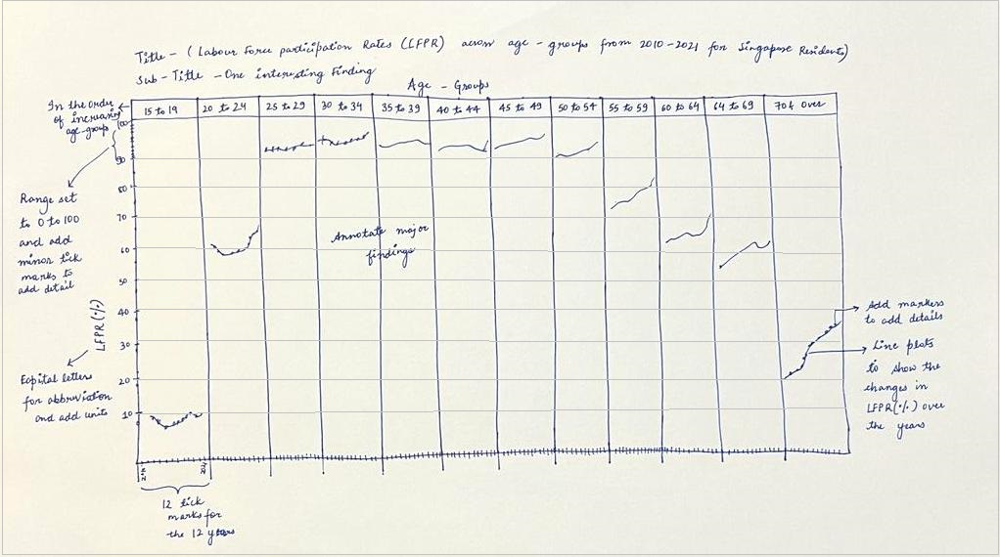
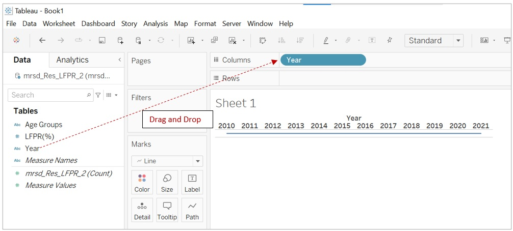
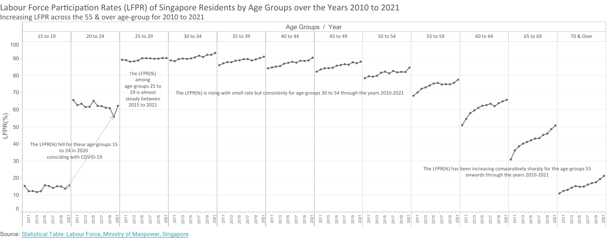

```{r setup, include=FALSE}
knitr::opts_chunk$set(echo = FALSE, warning = FALSE)
```

# 1. Overview
A data visualization for the Singapore's Labor Force Participation Rate (LFPR) for among different age-groups over the period 2010-2021 is given. The article aims to critique the data visualization on various aspects of the visualization ranging from the quality of data cleaning that was done, the type of graphics used to the labeling of the data points. 

# 2. Given visualization


By the look of it, it can be seen that a lot of effort has gone into creating the visualization. But does it communicate any concrete information? Unfortunately, the answer is No! This is a reminder of the following quote:

>"Everyone spoke of information overload, but what there was in fact was a non-information overload."     
- Richard Saul Wurman, What-If, Could-be (Philadelphia, 1976)

Since the overall design purveys graphical design rather than quantitative information, the above chart fits into the category of "Self-Promoting Graphics: The Duck" and contains a lot of *Chartjunk*^1^.
To justify the critical claims, it is important to point out the granular details of clarity and aesthetics.

# 3. Critiques

Before jumping onto pointing specific issues in the chart, getting the overall context and taking inspiration from the definitions of graphical excellence will help in setting the direction right for the critiques.

Important aspects to consider while judging the context of a chart^2^:
    
   a. **Know the requirements of the visualization**:
  The chart aims to show the trends in LFPR across various age-groups in the Singapore over the time period 2010 to 2021.
   
   b. **Know the audience**: 
  This chart is created using data provided by the Ministry of Manpower (MOM), Singapore. Therefore, it is safe to assume that the data is generated for a wide audience including but not limited to the policy makers, the corporate sector and the general population for their awareness. 
  
Tufte^1^ says that "Excellence in statistical graphics consists of complex ideas communicated with clarity, precision and efficiency". According to him, a graphical display should:

   a. Show the data
   b. Induce the viewer to think about the substance, rather than about methodology,
graphic design, the technology of graphic productions, or something else
   c. Avoid distorting what the data have to say
   d. Present many numbers in a small space
   e. Make large data sets coherent
   f. Encourage the eye to compare different pieces of data
   g. Reveal the data at several levels of detail
   h. Serve a reasonably clear purpose: description, exploration, tabulation, or
decoration
   i. Be closely integrated with the statistical and verbal descriptions of a data set

Now that there is clarity on various aspects of a good data visualization, let us dive into the details.

## 3.1 Clarity

Overall, the chart lacks various components of a graphical display listed by Tufte e.g., it lacks substance, clear display of data points, easily comparable data values and trends, revelation of details and a clear description or expression of a purpose.
Let us look at specific clarity related issues among various components of the given chart: 

### 3.1.1.  Lack of clarity in title of the chart : 
The title of the chart is just "Labour force participation rate", which is just one of the 3 variables involved in the data visualization. The other two variables being the age-group and the year, are completely missed out from the title. Mere mention of the variable name gives no clarity about what is there in the visualization. The title should clearly answer the following questions:

   a. Which country's Labor force participation rate is visualized? 
   b. What is the time period involved? 
   c. Are there definite population segments represented in the graph? If yes, then what are they?

  Such things should not be left to the imagination of the audience and must be clearly specified in the title itself.

### 3.1.2.  Lack of a sub-title : 
The purpose of a sub-title is usually to provide an important piece of information that is represented by the chart. The given visualization lacks it which leads to missing context and leaves the audience wondering about the purpose of the visualization.

### 3.1.3.  Ambiguity in the axes titles and labels : 
The ambiguity is explained below:
    
   a. The y-axis title which is just "Lfpr" lacks clarity. "Lfpr" must all be in capitals for it to make sense and it is better to specify it along with its full-form first before using it as abbreviation. The units are missing from both, the title as well as the labels, a '%' sign should be specified in either of them.
    
   b. The bottom x-axis title "Year" is repeated multiple times for each of the data points on the axis, which is completely unnecessary. The label "2015" is also repeated multiple times, leading to ambiguity as there should be additional labels because apparently there is a trend in the area charts having different LFPR(%) values on the y-axis within each of the age-groups which suggests there is time series data for each of the age-groups. There is no clarity on the year intervals in the time series.
    
   c. The top x-axis labels have some missing letters which also contributes to lack of clarity about what are the missing letters.
   
### 3.1.4 Misleading ordering of the area plots: 
The ordering of data on the x-axis which is in the order of increasing LFPR(%) values also creates ambiguity while comparing LFPR(%) trends for the age-groups and is pointless. The ordering and together with missing axis labels can easily mislead the audience forcing them to think that the LFPR(%) has been increasing. The ordering should have been in the order of increasing age-groups.  

### 3.1.5. Overlapping values in the age-groups: 

The age-groups "70 to 74", "75 and over" and "70 and over" are not mutually exclusive, in fact, in the data set the age-groups "70 to 74", "75 and over" fall under the age-group "70 and over". This suggests that data exploration and cleaning was not done properly and creates ambiguity as to which of these age-groups should be focused on while comparing LFPR(%) across different age-groups and drawing insights. 

### 3.1.6.  Lack of chart caption: 

There is no mention of the source of data in the caption. This makes it unclear to the user as to whether the chart comes from a reliable data source or not.

### 3.1.7.  Missing tick marks on the y-axis : 

The y-axis contains continuous data for the LFPR(%) ranging from 0% to 100% therefore it becomes important for the axis to have tick marks.^2^ Lack of tick marks makes it ambiguous for the users to read and match the points on the area charts to the LFPR(%) values on the y-axis.

## 3.2 Aesthetics
There are a few issues with the aesthetics of the given chart:

### 3.2.1.  Width of age-group area charts is narrow :

The current visualization does not communicate the LFPR(%) trends over the years clearly because of the narrowness of the charts. The narrowness also downplays the LFPR(%) changes therefore the width of the plots can be increased to increase the view-ability of the chart.^2^

### 3.2.2.  Use of incorrect chart type : 

Area chart is not the appropriate chart type for the given data variables because of the following reasons^3^:
   
   a. The LFPR(%) cannot be added together per year for each of the age-groups as they represent the rate in their in respective age-groups. 
   
   b. Area charts are not suitable to display minor changes in the data values, in this case the change in LFPR(%) is minor for most of the age-groups, over the years. 
   
   c. The number of age-groups and the number of years used for the visualization are also too many for area charts.

### 3.2.3.  Lack of chart boundary : 

The chart does not have a boundary and the grid lines end abruptly, extending outwards from the chart which is degrading the aesthetic quality of the chart.

### 3.2.4.  Meaningless coloring of the age-groups :

The age-groups are unnecessarily colored, the colors do not add any additional meaning to the chart as the top x-axis already specifies the age-groups corresponding to the area charts.

### 3.2.5.  Size of titles and labels is small : 

The size of the titles and labels is small in comparison to the overall chart size and can be increased for better aesthetics.

# 4. The Makeover
## 4.1 Proposed Visualization
Here is the sketch of the proposed visualization:



**Advantages of the proposed visualization over the given one:**
   
   1. The title clearly defines what data is represented in the data visualization and the sub-title gives an interesting insight from the visualization. The title also clearly defines the abbreviation LFPR before using it.
   
   2. The axes labels represent the data represented by them and are non-ambiguous. The tick marks on the y-axis have 10 major ticks for LFPR(%) values ranging from 0 to 100 and 10 minor tick marks for each of the 10 major tick interval, together they cover the 100 percentage points of LFPR(%). This level of detail makes it easier for the users to map the points on the chart to the LFPR(%) values easily.
   The lower x-axis label contains 12 tick marks for each of the 12 years which make it easier for the user to map data on the line charts to each of the years.
   
   3. The line plots represent the changes in LFPR(%) more clearly, together with the markers which make it easy for the users to map the LFPR(%) values to the corresponding years.
   
   4. The ordering of the plots in the increasing order of age-groups makes it easier for the users to gain insights about LFPR(%) changes as they will know where to find which age-group.
   
   5. The single color representation of the line charts clearly tell the user that they represent different values of same features.
   
   6. The added annotations on the chart make the data visualization complete and independent of any explanation.
   
## 4.2 Data Preparation Steps
Here is step by step process of how the data set for the proposed visualization was prepared:

**Step 1:** 
The data set [Resident Labour Force Participation Rate by Age and Sex](https://stats.mom.gov.sg/Pages/LabourForceTimeSeries.aspx) was downloaded from the official website of Ministry of Manpower(MOM), Singapore and was saved into the *Visual Analytics* project directory appropriately. The data set is in *csv* file format and contains 2 sheets.

**Step 2:**
In this step, an initial cleaning of data was done in Microsoft Excel itself, the rows from row 19 in sheet 2 were selected and deleted as shown in *Fig. 2 * below. This was done to remove away the LFPR(%) data records for Males and Females over the years, as it will not be used in our data visualization. After deletion, the data set was saved in place.

{width=70%}

**Step 3:**
In this step, Tableau Desktop application was launched and the data set was dragged from the folder and simply dropped into the Tableau Homepage as shown in *Fig. 3 * below.


The view of the imported *csv* file is displayed in *Fig. 3b*.

{width=50%}

**Step 4:**
In this step, the sheet *mrsd_Res_LFPR_2* containing the data used in our visualization was selected. The view is shown in *Fig. 4 * below.

{width=90%}

**Step 5:**
In *Fig. 4 *, it can be seen that the column names are not recognized automatically by Tableau. In this step, we resolve this issue by checking the check box next to *Cleaned with Data Interpreter *. Subsequently, the data set columns were appropriately adjusted by Tableau.

{width=90%}


**Step 6:**
Then the year columns ranging from 1991 to 2021 were selected and *Pivot* option was selected from the drop-down menu that appears on clicking the inverted triangle box in the column header as shown in *Fig. 6 * below. 

{width=70%}

**Step 7:**
The data set got transformed and then contained 3 columns, the un-pivoted 'Age(Years)/Sex' and 2 pivoted columns. The pivoted columns were renamed by choosing the rename option from the drop-down menu that appeared by clicking the inverted triangle box (that can be found by hovering on the column headers). The column that contained year data was renamed as 'Year' and the column with LFPR(%) values was renamed as 'LFPR(%)' as shown in *Fig. 7b* 

{width=70%}


{width=80%}

**Step 8:**
Our use case involved years from 2010-2021, hence the earlier year records were removed using the *Filter * function in Tableau. The filter tab can be found top right corner of the page, a pop up window opens on clicking the *Add * option under the *Filter * tab. A new filter was added by clicking on *Add * button and choosing the field on which the filter had to be added. Years 1991 to 2009 were selected and excluded. The detailed steps are shown in the *Fig. 8a* to *Fig. 8d* below.

{width=80%}


{width=70%}

{width=50%}

{width=50%}

**Step 9:**
After the 'Year' field was filtered, another filter was added on the 'Age (Years)/Sex' to remove the records for *Total*, *70 to 74* and *75 & over* because they were not used in the visualization. The age-groups *70 to 74* and *75 & over* are covered under the age-group *70 & over* the original data set hence the former were excluded. The detailed steps are shown in *Fig. 9a * to *Fig 9d* below.

{width=70%}

{width=50%}

{width=50%}

{width=50%}

**Step 10:**
The data type of the 'LFPR(%)' is incorrectly recorded as string type (indicated as *Abc* in the column header), it was changed by clicking on the data type tab and selecting the *Number(decimal)* option from the drop-down menu.

{width=70%}

The prepared data set looks as follows:

{width=50%}


## 4.3 Visualization Preparation Steps

**Step 1:**
Switch to Sheet 1 was done to start creating the visualization. Then the 'Year' field was dragged from the *Data * pane and dropped into the *Columns * tab as shown in *Fig. 11*.

{width=80%}

**Step 2:**
Then the 'LFPR(%)' field was dragged from the *Data * pane and dropped into the *Rows * tab. Subsequently, the measure for it was selected as "SUM", this was done to aggregate the LFPR(%) values for all the age-groups first. 

{width=80%}


**Step 3:**
In this step, the 'Age Groups' field was dragged from the *Data * pane and dropped into the *Columns * tab. Merely placing the 'Age Groups' field next to the 'Year' field resulted in a different plot, then swapping their places resulted in the desired plot shown in *Fig. 13*.

{width=80%}

**Step 4:**
Then the chart fit was changed from *Standard* to *Entire View*, which transforms the chart to fit the chart area. 

{width=80%}

**Step 5:**
Then points were added to the line charts by selected the appropriate marker from *Markers* under the *Color* Mark in the *Marks* pane as shown in *Fig. 15*.

{width=70%}

**Step 6:**
In this step, the y-axis label and tick marks were edited. First, the y-axis label tab was right-clicked and *Edit Axis * option was chosen, then the label name and tick options were changed. The detailed steps are shown in *Fig 16a * and *Fig 16b*.  

{width=50%}

{width=70%}

**Step 7:**
Then *Caption * option was checked in the drop-down menu that appears on right clicking the chart area. And the caption was edited as shown below.

{width=50%}

**Step 8:**
In this step, the borders were changed using the *Borders * option from the *Format * tab in Tableau. The detailed changes are depicted in *Fig 18*.

{width=70%}

**Step 9:**
The chart title and sub-title were added by double-clicking on *Sheet 1*.

{width=50%}

**Step 10:**
In this step, annotations were added to the chart by right-clicking on the chart and selecting the annotations. Two annotation options were used in the plot - *area* and *point*. The *area* annotation allows addition of text anywhere in the chart and the *point* annotation allows to point to any point on the plot. The created annotations were formatted using the options that appear on right-clicking the annotations. The detailed steps are shown below.

{width=50%}

{width=50%}


{width=40%}

{width=40%}


The final visualization can be found in my Tableau account using this [tableau link](https://public.tableau.com/app/profile/karishma.yadav2567/viz/LabourForceParticipationRatesLFPRofSingaporeResidentsbyAgeGroupsovertheyears2010to2021/Sheet1?publish=yes). 

{width=125%}

## 4.4 Major Observations from the data visualization:

   1. The age groups 24 to 54 have LFPR(%) over 70% indicating that this age-group represents the working population of Singapore. 
   2. The lower age group 15-19 and higher age-group 70 & over have similar LFPR(%) lying in the range 10-20% LFPR(%), this is because population in the age-group 15-19 is too young to participate and the 70 & over composes of the population close to retirement. 
   3. The age-group 20 to 24 has LFPR(%) between 50% to 70% for the years 2010 to 2021 indicating that the residents in Singapore start working in their early 20s.
   
   2. The LFPR(%) changes for the age-groups 15 to 24 have up and down variations in the LFPR(%) for the period 2010-2021. The age-group 24 to 29 saw a steady LFPR(%) between 2015 to 2021 while the age-groups 30 to 54 saw slight increases in LFPR(%). The older age-groups have seen comparatively steep rise in LFPR(%) for the years 2010-2021. These trends suggest that the population in Singapore could be ageing.
   
   3. The LFPR(%) changes for the age-group 15 to 19 and 20 to 24 show a fall in LFPR(%) for the year 2020, which coincides with the COVID-19. The fall in the age-group 20-24 is higher compared to 15-19, while the rest of the age-groups did not see any fall in 2020 and the higher age-groups from 55 onward in fact still continued to see a increasing LFPR(%)

## References: {.appendix}

1. The Visual Display of Quantitative Information by Edward R. Tufte
2. Visual Analytics Lesson 2 [slide-deck](https://isss608-ay2021-22t2.netlify.app/lesson/lesson02/lesson02-designing-graphs-to-enlighten#44) by Prof. Kam Tin Seong
3. [Area Charts](https://blog.datawrapper.de/area-charts/)
4. Data Visualization to improve Data Stories, [Analyticsvidhya](https://www.analyticsvidhya.com/blog/2020/07/8-data-visualization-tips-to-improve-data-stories/)


