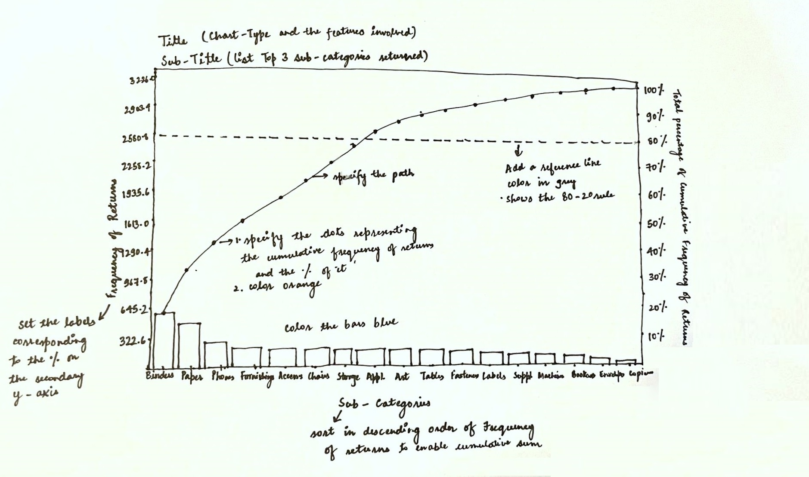
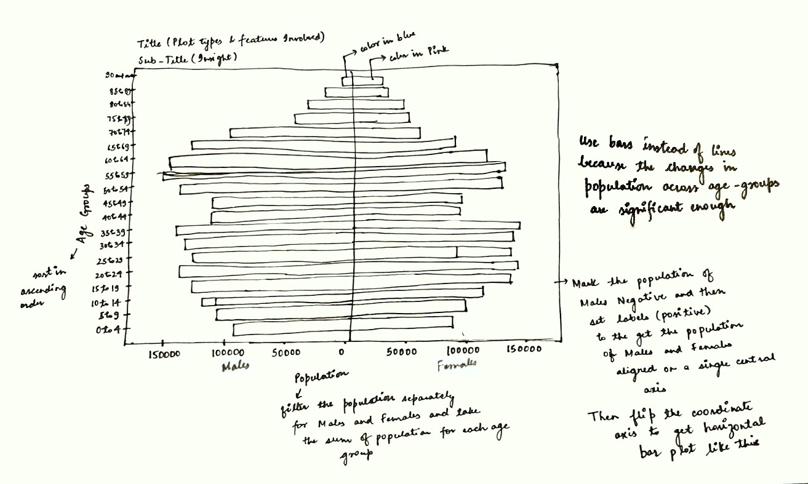

---
author:
  - first_name: "Karishma"
    last_name: "Yadav"
    url: https://www.linkedin.com/in/karishma-yadav-02310a168/
    affiliation: MITB, Singapore Management University
    affiliation_url: https://scis.smu.edu.sg/master-it-business?gclid=Cj0KCQiAxc6PBhCEARIsAH8Hff3m7di7-Qidt0qZHh13hQZzJAvOyCn0sVtYwH-uROOAAnCuvNkgSc0aAnboEALw_wcB
title: "Take-Home Exercise 01: Data Visualizations in R"
description: |
  This is the first take-home exercise in a series of take-home exercises for the *Visual Analytics* module. In this exercise, we will prepare 2 data visualizations using two different data sets. One is a Superstore data set and another is a population data set taken from [Department of Statistics](https://www.singstat.gov.sg/), Singapore.
date: "`r Sys.Date()`"
output: 
  distill::distill_article:
    toc: TRUE
    theme: thex01.css
    toc_float: true
    toc_collapsed: true
    toc_depth: 2
---

```{r setup, include=FALSE}
knitr::opts_chunk$set(echo = FALSE)
```

### Loading the necessary packages:

```{r, code_folding=TRUE, echo = TRUE, warning = FALSE, message = FALSE}
packages = c('tidyverse', 'readxl','knitr','grid')
for(p in packages)
{
  if(!require(p,character.only = T))
  {
    install.packages(p)
  }
  library(p,character.only = T)
}
```
# 1. Pareto Chart for the Superstore Data

## 1.1 Data Preparation
### Loading the data required for the visualization

The excel file "Superstore-2021.xls" is loaded using the function *read_xls* from the **readxl** module. It contains several sheets, the *sheet* argument in the *read_xls* function is used to specify the worksheet names. The work sheets "Orders" and "Returns" are loaded into data frames "orders" and "returns" respectively.
 
```{r,code_folding=TRUE, echo = TRUE, warning = FALSE, message = FALSE}
orders <- read_xls("Data/Superstore-2021.xls", sheet = "Orders")
returns <- read_xls("data/Superstore-2021.xls", sheet = "Returns")
```

### Inner Join for orders and returns

To create the pareto chart of returns for sub-categories of products ordered, we need to merge the fields "Sub-Category" field from the "orders" data frame and "Returns"field from the "returns" data frame. To do this, we use the *left_join* function and use the "Order ID" field, that is there in both the data frames.

```{r, code_folding=TRUE, echo = TRUE, warning = FALSE, message = FALSE}
joined_tab <- left_join(returns, orders, 
                        by = c('Order ID' = 'Order ID'))
```

To aggregate the number of returns by "Sub-Category", *group_by* is done on the "Sub-Category" field. A new data frame is created, which is saved as "freq_returned".

```{r, code_folding=TRUE, echo = TRUE, warning = FALSE, message = FALSE}
freq_returned <- joined_tab %>% 
                 group_by(`Sub-Category`) %>% 
                 summarise("Returns"=n()) %>%
                 ungroup()
```

Then the data in the "freq_returned" data frame is sorted by the number of returns.

```{r, code_folding=TRUE, echo = TRUE, warning = FALSE, message = FALSE}
freq_sorted <- freq_returned[order(freq_returned$Returns,
                                   decreasing=TRUE), ]
```

To create a pareto chart, the cumulative returns frequency for each sub-category of product were calculated. The cumulative returns frequency were further used to calculate the cumulative returns frequency as a percentage of total cumulative returns frequency.

```{r, code_folding=TRUE, echo = TRUE, warning = FALSE, message = FALSE}
freq_cum <- freq_sorted %>%
            mutate(cumfreq = cumsum(Returns))
freq_cum <- freq_cum %>%
            mutate(cumperc = cumfreq/sum(Returns)*100)
```


## 1.2 Visual: Frequency of Returns by Sub-Category

### Proposed sketch for the Pareto chart
{width=1000px}

### Pareto chart using R

The following **ggplot2** functions were used to create the standard pareto chart:

1. *geom_bar*: Used to create the bars of frequency of returns for each sub-category. The argument stat = "identity" is used to ensure that the heights of the bars represent the values to y aesthetic.

2. *geom_point*: Used to map the cumulative frequency values of returns to each sub-category as points on the plot.

3. *geom_path*: Used to connect the observations in the order in which they appear in the data.

4. *geom_hline*: Used to create a horizontal line on the plot to mark important points on the plot curve and the y-axes.

5. *scale_y_continuous*: Used to specify the tick labels for the y-axis, and add a secondary axis to the plot using the argument "sec.axis".

These functions were added to the *ggplot2* layout layer by layer as shown in the folded code.
Other functions, *labs* and *theme* were used and their arguments were modified to create the plot same as the one sketched above.

```{r, code_folding=TRUE, layout="l-body-outset",fig.height=4,fig.width=7,echo = TRUE, warning = FALSE, message = FALSE,}
labels_cumperc <- c("0"="0%", "10"="10%", "20"="20%", "30"="30%", "40"="40%", "50"="50%", 
                    "60"="60%", "70"="70%", "80"="80%", "90"="90%", "100"="100%")
pareto_chart <- ggplot(freq_cum, aes(x = reorder(`Sub-Category`,-Returns))) +
                geom_bar(aes(y=Returns), fill = "dodgerblue4", stat="identity") +
                geom_point(aes(y=cumfreq),color= "orangered3",size=1) +
                geom_path(aes(y=cumfreq,color= "orangered1", group=1)) +
                geom_hline(aes(yintercept = sum(freq_cum$Returns)*.8),colour="#999999", linetype="dashed")

pareto_chart <- pareto_chart +
                labs(title = "Pareto Chart of Returns frequency for Sub-Categories of Products for Superstore in 2021", subtitle = "Top 3 Sub-Categories returned for Superstore include Binders, Books and Phones", 
                x = 'Sub-Categories', y ='Frequency of Returns')
  
pareto_chart <- pareto_chart + 
                scale_y_continuous(breaks = round(seq(0, max(freq_cum$cumfreq), max(freq_cum$cumfreq)/10),1), 
                sec.axis = sec_axis((~./sum(freq_cum$Returns)*100), breaks = seq(0,100,10), 
                labels= labels_cumperc, name = "Total Percent of Cumulative Frequency of Returns"))

pareto_chart <- pareto_chart +
                theme_bw()+ 
                theme(legend.position = "none")+
                theme(plot.title = element_text(size=10))+
                theme(plot.subtitle = element_text(size=8))+
                theme(axis.title = element_text(size=6, hjust=0.5))+
                theme(axis.text.x=element_text(size=4.25, vjust=0.5))+
                theme(axis.text.y=element_text(size=6, vjust=0.5))
pareto_chart
  
```

# 2. Population Pyramid for the Singapore Population

## 2.1 Data Preparation
This visualization uses variables from the data set taken from the link. The data set was loaded using the *read_csv* function in R.

```{r,code_folding=TRUE, echo = TRUE, warning = FALSE, message = FALSE}
sing_popn <- read_csv("Data/respopagesextod2021.csv")

```
```{r}
#specifying the order of age groups on the left y-axis
age_order = c("0_to_4", "5_to_9", "10_to_14", "15_to_19",    "20_to_24","25_to_29", "30_to_34" , "35_to_39" , "40_to_44", "45_to_49" , "50_to_54" , "55_to_59", "60_to_64", "65_to_69",    "70_to_74" , "75_to_79","80_to_84" , "85_to_89" , "90_and_over")

```

To get the population organized separately for Males and Females in various age groups, the data frame was grouped by "AG" and "Sex" fields and the sum of "Population" was calculated on aggregation.

```{r, code_folding=TRUE, echo = TRUE, warning = FALSE, message = FALSE}
sing_popnew <- sing_popn %>%
  group_by(AG, Sex) %>%
  summarise(Population=sum(Pop))%>%
  ungroup()

tot_pop = sum(sing_popnew$Population)

```

To create the population pyramid, horizontal bar charts were used to visualize the population of males and females into various age groups and aligning them on the same central axis. To align the central axis, transformation of the population of males variable was done as negative and then labelled as its original values in the plot.

```{r, code_folding=TRUE, echo = TRUE, warning = FALSE, message = FALSE}
sing_popnew$Pop <- ifelse(sing_popnew$Sex == "Males",
                          
                  (-sing_popnew$Population),sing_popnew$Population)

```

## 2.1 Visual: Age-Sex Population Pyramid
### Proposed Sketch for the Population Pyramid
{width=1000px}
To visualize the above sketch in R, following functions from *ggplot2* have been used:

1. *geom_bar*: 2 geom_bars were used to create bars of population values for Males and Females separately for the corresponding age groups.
2. *coord_flip*: Used to flip the coordinate axes and transform the default orientation of bars from vertical to horizontal.

Along with the above 2 functions, *scale_x_continuous*, *scale_y_continuous*, *labs* and *theme* functions were used to change the color, labels and titles of the plot.

### Population Pyramid using R:

```{r,code_folding=TRUE, layout="l-body-outset",fig.height=4,fig.width=7,echo = TRUE, warning = FALSE, message = FALSE}
labels_pop <- c("200000","150000", "100000","50000","0","50000", "100000","150000","200000")
population_pyramid <- ggplot(sing_popnew, aes(order(match(x = AG,age_order)), y = Pop, fill = Sex)) + 
                      geom_bar(data = subset(sing_popnew, Sex == "Females"), stat = "identity") + 
                      geom_bar(data = subset(sing_popnew, Sex == "Males"), stat = "identity")   

population_pyramid <- population_pyramid +
                     labs(title = "Age-Sex Population Pyramid, Singapore 2021", 
                     subtitle = "Population is skewed towards people aged 15 to 39 and 50 to 64 for Males and Females", 
                     x = 'Age Groups', 
                     y ='Males                                                        Females\nPopulation')

population_pyramid <- population_pyramid +
                      scale_x_continuous(breaks = seq(1,19,1),labels=age_order) +
                      scale_y_continuous(breaks = seq(-200000,200000,50000),
                      labels=labels_pop)
                      

population_pyramid <- population_pyramid + coord_flip()

population_pyramid <- population_pyramid + 
                      theme_bw()+ 
                      theme(legend.position = "none")+
                      theme(plot.title = element_text(size=10))+
                      theme(plot.subtitle = element_text(size=9))+
                      theme(axis.title = element_text(size=8, hjust=0.5))+
                      theme(axis.text.x=element_text(size=6, vjust=0.5))+
                      theme(axis.text.y=element_text(size=6, vjust=0.5)) +scale_fill_manual(values=c("#CC79A7","#0072B2"))
population_pyramid
```
# 3. R vs Tableau

The above visualizations were also created using [Tableau](https://public.tableau.com/app/profile/karishma.yadav2567#!/?newProfile=&activeTab=0). There are quite a number of points of differences between using Tableau vs ggplot2 package from R for visualizations.

1. **Economic and developmental**: Tableau is a proprietary software whereas R is an open source software. This makes tableau expensive to use for a longer period of time as well as slow and restricted in terms of development of new features.

2. **Reproducibility and Automation**: In R, same piece of code can be used to generate same kinds of plots by slightly modifying the code with change in features, time-period etc.

3. **Customization**: Although tableau features a lot of options but it is not as flexible as R in terms of customization, which allows for granular level changes in the plots.

4. **Speed**: In terms of speed, creating visualizations in tableau might be faster than R.

5. **Skill**: Tableau requires less technical knowledge to operate compared to R.

6. **End-to-End Solution**: R provides end-to-end solution for a project that requires data cleaning, transformation, visualization and modelling whereas tableau is good for creating good visualizations if clean data is provided.

## References: {.appendix}

[Distill for RMarkdown](https://rstudio.github.io/distill/basics.html)

[ggplot2 documentation](https://ggplot2.tidyverse.org/reference/)
