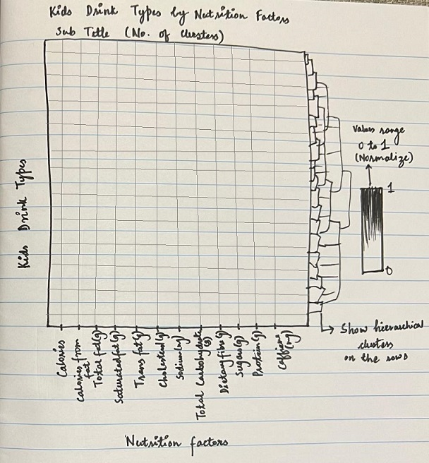
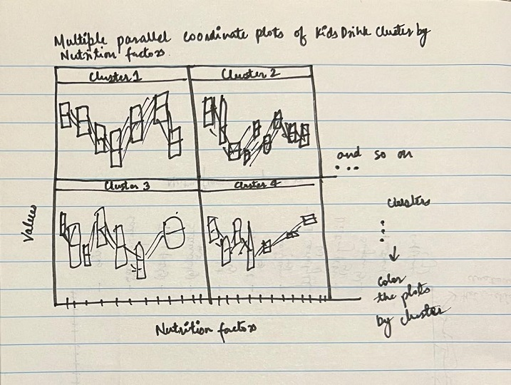

```{r setup, include=FALSE}
knitr::opts_chunk$set(echo = FALSE)
```

# 1. R packages used in this exercise

The following R packages are used in this exercise:

- *tidyverse*: Package is loaded to use functions to import, tidy, manipulate and visualize the data.

- *corrplot*: is used to build correlation matrix that supports automatic variable reordering to help detect hidden patterns among variables.

- *ggstatplot*: is an extension of ggplot2 package for creating graphics with details from statistical tests included in the plots themselves.

- *heatmaply*: to build interactive heat maps.

- *seriation*: for ordering the rows or columns in the models and visuals.

- *dendextend*: to provide us options to choose distancing and linkages in hierarchical clustering.

- *rmarkdown*: provides the function "paged_table()" which provides a good view of the data sets in table format.

-*GGally*: used to provide us the "ggparcoord()" function to plot parallel coordinate plots in R.

They are loaded using the code chunk given below. The following code chunk passes the list of packages as a vector that is iterated over using a *for loop* and all the packages in the vector are loaded. The *if* condition ensures that the packages get installed on running the code chunk, if they are not already installed. Overall, the code chunk checks all the boxes when it comes to using any number of packages in R with ease.

```{r, echo = TRUE, warning = FALSE, message = FALSE}
packages = c('rmarkdown','corrplot', 'ggstatsplot','tidyverse','heatmaply','seriation', 'dendextend','GGally')
for(p in packages)
{
  if(!require(p,character.only = T))
  {
    install.packages(p)
  }
  library(p,character.only = T)
}
```

# 2. Data Preparation

## 2.1 Importing the data set
The given task: Create a data visualization to segment kid drinks and other by nutrition indicators. For the purpose of this task, *starbucks_drink.csv* should be used.

For the purpose of this task, the data set was downloaded from the course e-learn platform and saved to the exercise folder in the course project repository. The following code chunk was used to load the data set into R.

```{r, echo = TRUE, warning = FALSE, message = FALSE}
starbucks_drinks <- read_csv("data/starbucks_drink.csv")
```

In the above code chunk, *read_csv* function from *tidyverse* package was used to load the data set as the given data set is in *.csv* format. The data set is named "starbucks_drinks".

Let's have a look at the data set.

```{r, layout="l-body-outset", echo = TRUE, warning = FALSE, message = FALSE}
paged_table(head(starbucks_drinks))
```

If a data frame has a large number of rows it might not be practical to display it fully inline^1^. Here, the *rmarkdown::paged_table()* function that allows pagination of rows and columns of a data set was used to load the first 6 rows (head) of the data set inline. This makes the users to view the table view of a data set in an interactive manner.

In the data set view, the data type of the fields are displayed under their respective names. It can be seen that, for the "Caffeine (mg)" field, the data type is <chr> which is incorrect as it contains numeric values.

The *as.numeric()* function is used to change the data type of the "Caffeine(mg)" field to numeric type and the *class* function is used to confirm that the data type of the "Caffeine(mg)" field is "numeric".

```{r, echo = TRUE, warning = FALSE, message = FALSE}
starbucks_drinks["Caffeine(mg)"] <- as.numeric(starbucks_drinks$`Caffeine(mg)`)
class(starbucks_drinks$`Caffeine(mg)`)
```
## 2.2 Subsetting the data set on Category

Now, for the purpose of the given task, the *starbucks_drinks* data set needs to be filtered on the "Category" field where the field is equal to "kids-drinks-and-other". *filter* function is used as follows to accomplish this step.

```{r, echo = TRUE, warning = FALSE, message = FALSE}
kids_drinks <- starbucks_drinks %>%
  filter(Category == "kids-drinks-and-other" )
```

The above paged table view also indicates that there are a few missing values in our data set, let us have a look at the missing values.

## 2.3 Handling Missing values

```{r, echo = TRUE, warning = FALSE, message = FALSE}
colSums(is.na(kids_drinks))
```

The *colSums()* function give sum of values per columns and *isna()* function returns a list of Boolean values indicating if each value in the fields in the data frame is missing or not. 
The output shows that the fields "Milk" and "Whipped Cream" have 5 missing values respectively. To decide how to deal with the missing values, let us first explore the unique values in these <chr> type fields.

```{r, echo = TRUE, warning = FALSE, message = FALSE}
#unique values in the Milk field
unique(kids_drinks$Milk)

#unique values in the Whipped Cream field
unique(kids_drinks$`Whipped Cream`)
```

Intuitively, we can fill the missing values with "No Milk" and "No Whipped Cream" in the fields "Milk" and "Whipped Cream" respectively.

```{r, echo = TRUE, warning = FALSE, message = FALSE}
kids_drinks$Milk[is.na(kids_drinks$Milk)] <- 'No Milk'
kids_drinks$`Whipped Cream`[is.na(kids_drinks$`Whipped Cream`)] <- 'No Whipped Cream'
```

Let us look at the summary of the data set *starbucks_drinks* to find out any discrepancies or outliers in the data fields.

## 2.4 Exploring the data set

```{r layout="l-body-outset", echo = TRUE, warning = FALSE, message = FALSE}
summary(kids_drinks[,3:15])
```
The *summary()* function gives us the minimum, maximum, mean, median, 1st quartile and 3rd quartile values for each of the fields. The field "Caffeine(mg)" seems to have outliers as the maximum value is significantly greater than the 3rd quartile. Let us plot a boxplot for the field to confirm if there are outliers.

## 2.5 Removing Outliers

```{r, echo = TRUE, warning = FALSE, message = FALSE}
ggplot(kids_drinks, aes(y=`Caffeine(mg)`)) + 
  geom_boxplot(fill="gray") +
  scale_color_grey() + 
  labs(title="Box plot of Caffeine(mg)", subtitle = "Caffeine(mg) has an outlier") + 
  theme_classic()
```
The box plot confirms that there is an outlier with value over 200 mg, while the rest of the data points have values less than 50 mg. The outlier was filtered away using the following piece of code.

```{r, echo = TRUE, warning = FALSE, message = FALSE}
kids_drinks <- kids_drinks %>%
  filter(`Caffeine(mg)` <200)
```

Let us also check if the data set contain duplicate records.

```{r, echo = TRUE, warning = FALSE, message = FALSE}
sum(duplicated(kids_drinks))
```
The *sum()* function is used to add the number of duplicate records returned by applying the *duplicated()* function on the data set. There are no duplicate records in the data set. 

## 2.6 Correlation Matrix

Moving on to segmentation of kids drinks and other category based on nutritional factors, we can see that there are fields "Names", "Milk", "Whipped Cream" and "Size"/"Portion(oz)" of the drink that affect the values of the nutritional factors. The field "Size" corresponds to "Portion(oz)". We need to combine these fields to get the drink type for this category. Let us look at the correlation plot of the numerical fields in the data to see if the field "Portion(oz)" is correlated with the rest of them. 
A correlation analysis is done using the *ggcorrmat()* function of the *ggstatsplot* package at confidence level of 95%.

```{r, echo = TRUE,fig.height = 10, fig.width = 10, warning = FALSE, message = FALSE}
#summary(kids_drinks_and_other)
ggstatsplot::ggcorrmat(
  data = kids_drinks, 
  cor.vars = 3:15,
  ggcorrplot.args = list(outline.color = "black", 
                         hc.order = TRUE,
                         tl.cex = 14),
  title    = "Correlogram for Starbucks dataset",
  subtitle = "7 pairs are not significantly correlated at p < 0.05",
   colors = c("#CC6600", "white", "#000066"), outline.color = "black",
  ggtheme = theme_minimal()
)
```

The above correlation plot shows that the field "Portion(oz)" is not correlated with many of the nutritional factors which means the values of the nutritional factors do not change linearly with change in the portion of the drink, therefore it cannot be used to aggregate the nutritional values. Now, we need to create drink types using the fields "Names", "Milk", "Whipped Cream" and "Size". The *paste()* function is used to create a new field "kids_drink_type" as follows:

# 3. Proposed Visualization

## 3.1 Proposed Heatmap

{width = 0.6}

## 3.2 Proposed Parallel Coordinate Plots

{width = 0.7}

# 4. Interactive Heatmap

## 4.1 Data Preparation

Now, we need to create drink types using the fields "Names", "Milk", "Whipped Cream" and "Size". The *paste()* function is used to create a new field "kids_drink_type" as follows:

```{r, echo = TRUE, warning = FALSE, message = FALSE}
kids_drinks$kids_drink_type <- paste(kids_drinks$Name," ",kids_drinks$Milk," ",
                                     kids_drinks$`Whipped Cream`,"-", kids_drinks$Size)
```

For the purpose of segmentation, hierarchical clustering is done on the data set. The data set for clustering needs to in matrix format because for this purpose *heatmaply* will be used which takes matrix as input. *heatmaply* produces interactive cluster heat maps using 'Plotly' and 'ggplot2' packages in R. A heat map is a graphical method for plotting high dimensional/ multivariate data, in which a table of numbers are encoded as a grid of colored cells.

From the data set, relevant fields are selected using the *select()* function from *dplyr* package in R. The fields have different range of values, and their distribution is also unknown. Therefore, normalization is performed on the data set to change the values of numeric columns in the data set to a common scale, without distorting differences in the ranges of values. 

The correlation plot will only use numerical values, therefore row names are set for the matrix so that the resulting heat map is labelled as per the row names.

## 4.2 Normalizing the data set

```{r, echo = TRUE, warning = FALSE, message = FALSE}
kids_starbucks <- dplyr::select(kids_drinks, c(19, 4:15))
kids_starbucks[, 2:13] <- normalize(kids_starbucks[, 2:13])
row.names(kids_starbucks) <- kids_starbucks$kids_drink_type
```

## 4.3 Heirarchical Clustering
Hierarchical clustering^2^ is a general family of clustering algorithms that build nested clusters by merging or splitting them successively. This hierarchy of clusters is represented as a tree (or dendrogram). The root of the tree is the unique cluster that gathers all the samples, the leaves being the clusters with only one sample.
The Agglomerative Clustering object performs a hierarchical clustering using a bottom up approach: each observation starts in its own cluster, and clusters are successively merged together. The linkage criteria determines the metric used for the merge strategy:

- **Ward** minimizes the sum of squared differences within all clusters. It is a variance-minimizing approach and in this sense is similar to the k-means objective function but tackled with an agglomerative hierarchical approach.

- **Maximum or complete linkage** minimizes the maximum distance between observations of pairs of clusters.

- **Average linkage** minimizes the average of the distances between all observations of pairs of clusters.

- **Single linkage** minimizes the distance between the closest observations of pairs of clusters.

To find the best method of linkage during hierarchical clustering, the data set is first converted into a matrix using the *data.matrix()* function. Then the *hclust()* function is used on the matrix (excluding the kids drink type field) to do the hierarchical clustering on the matrix and then *dend_expend()* function is used. 
- dend_expend^3^: A list with three items. The first item is called "dends" and includes a dendlist with all the possible dendrogram combinations. The second is "dists" and includes a list with all the possible distance matrix combination. The third. "performance", is data.frame with three columns: dist_methods, hclust_methods, and optim. optim is calculated (by default) as the cophenetic correlation between the distance matrix and the cophenetic distance of the hclust object.

```{r, echo = TRUE, warning = FALSE, message = FALSE}
kids_drinks_matrix <- data.matrix(kids_starbucks)
kdm_clust <- dist(kids_drinks_matrix[,-c(1)], method = "euclidean")
dend_expend(kdm_clust)[[3]]
```

## 4.4 Average Silhouette Approach to find optimum number of clusters
We see that the optim value is highest for the "average" linkage, therefore it was used to create the cluster heat map. Before plotting the heat map, let us first get the optimum number of clusters in our data set using the *find_k()* function. This uses the average silhouette approach. In short, the average silhouette approach measures the quality of a clustering. That is, it determines how well each object lies within its cluster. A high average silhouette width indicates a good clustering. The average silhouette method computes the average silhouette of observations for different values of k. The optimal number of clusters k is the one that maximizes the average silhouette over a range of possible values for k^4^.

```{r}
kids_drinks_clust <- hclust(kdm_clust, method = "average")
num_cluster <- find_k(kids_drinks_clust, krange = c(1:20))
plot(num_cluster)
```

The optimal number of clusters for this data set is found to be 10. 

## 4.5 The Heat map visual
Therefore in the *heatmaply()* function below, we have put the argument "k_row" equals to 10. The argument "Colv" is set to "NA" because we are only segmenting the rows (kids drink types). **Euclidean distance** is used as for calculating the cluster distances and **average linkage** is used to find the most suitable cluster for each drink type as identified earlier. The "seriate" argument from the "seriation" package to find an optimal ordering of rows and columns. Optimal means to optimize the Hamiltonian path length that is restricted by the dendrogram structure. This, in other words, means to rotate the branches so that the sum of distances between each adjacent leaf (label) is minimized. Here, the argument is set to "GW" (Gruvaeus and Wainer) as it potentially leads to faster heuristics^5^.

Plotting the cluster heat map:

```{r, echo = TRUE, fig.height = 8, warning = FALSE, message = FALSE}
heatmaply(kids_drinks_matrix[,-c(1)],
          Colv=NA,
          seriate = "GW",
          dist_method = "euclidean",
          hclust_method = "average",
          k_row = 10,
          fontsize_row = 2.5,
          fontsize_col = 5,
          colors = Reds,
          main="Kids Drinks Types at Starbucks by their nutritional value",
          xlab = "Kids Drinks Type (Starbucks)",
          ylab = "Nutritional Factors")%>% layout(height=800,width=600)
```

# 5. Parallel Coordinate Plots

## 5.1 Data Preparation
Now let us save the clusters using the *cut_tree()* function which allows us to specify the number of clusters. Then the mutate function was used to assign clusters to the data set.

```{r, echo = TRUE, warning = FALSE, message = FALSE}
cut_avg <- cutree(kids_drinks_clust, k = 10)
kids_drinks_clusters <- mutate(kids_starbucks, cluster = cut_avg)
paged_table(head(kids_drinks_clusters[,c(1,14)]))
```
We can see that the cluster as class integer, we need to convert it to factor to plot the parallel coordinate plots and facet wrap on it.

```{r, echo = TRUE, warning = FALSE, message = FALSE}
kids_drinks_clusters$cluster = as.factor(kids_drinks_clusters$cluster)
```

## 5.2 The Multiple Parallel Coordinate Plot
*ggparcoord()* is function from the "GGally" package in R, for plotting static parallel coordinate plots, utilizing the ggplot2 graphics package. Here, we use the "kids_drinks_clusters" data set, use nutrition factor fields to to be axes in the plot, "cluster" field is used to group(color) by, "scale" is set to "uniminmax" to univariately scale so the minimum of the variable is zero, and the maximum is one and facet wrap is done on the "cluster" field to see the values of the nutrition factors in each of the clusters.

```{r, echo = TRUE, fig.height = 10,fig.width = 12, warning = FALSE, message = FALSE}
ggparcoord(data = kids_drinks_clusters, 
           columns = c(2:13), 
           groupColumn = 14,
           scale = "uniminmax",
           alphaLines = 0.2,
           boxplot = TRUE, 
           title = "Multiple Parallel Coordinates Plots of Kids Drinks Types clusters at Starbucks by Nutrition Factors\nThe 10 clusters have different nutrition values") +
  facet_wrap(~cluster) + 
  theme(axis.text.x = element_text(angle = 30, hjust=1))
```

# 6. Conclusion

It can be observed that the nutrition values differ in each of the 10 clusters. 

   1. *Cluster 1*: Has nutrition values in the first quartile for all the nutrition factors except trans fat (g) and caffeine (mg) which are absent.
   
   2. *Cluster 2*: Has no trans fat(g), dietary fibre (g), caffeine(g) and protein (g) in the third quartile and other nutritional factors in the moderation.
   
   3. *Cluster 3*: Has high trans fat (g), calories, calories from fat, saturated fat (g), cholesterol (mg) and protein (g). Has low total carbohydrates (g), sodium (g) and sugars (g) and has no dietary fibre(g) and caffeine (mg).
   
   4. *Cluster 4*: Has high protein (g) and calories, no saturated fat (g) and caffeine (mg) and moderate values for the rest of the factors.
   
   5. *Cluster 5*: Has no trans fat (g) and everything else in moderation.
   
   6. *Cluster 6*: Has no trans fat (g), very low in cholesterol (mg) and low in protein with moderate values for the rest of the factors.
   
   7. *Cluster 7*: The drinks in this cluster have above median values for all the nutritional factors including caffeine (mg).
   
   8. *Cluster 8*: Has low total fat (g), calories from fat, saturated fat (g) and cholesterol (mg), no trans fat (g) and values higher than the median for all the remaining factors and very high caffeine (mg).
   
   9. *Cluster 9*: This cluster is similar to cluster 7 but has no trans fat (g).
   
   10. *Cluster 10*: This cluster has moderate amounts of calories, total carbohydrates (g), sugars (g), low sodium (g) and zero values for the remaining factors.

We conclude that the clusters vary in the values of various nutritional factors.

## References: {.appendix}

1. https://rstudio.github.io/distill/tables.html
2. https://scikit-learn.org/stable/modules/clustering.html
3. https://www.rdocumentation.org/packages/dendextend/versions/1.15.1/topics/dend_expend
4. https://uc-r.github.io/kmeans_clustering
5. https://isss608-ay2021-22t2.netlify.app/hands-on_ex/hands-on_ex05/hands-on_ex05-heatmap


