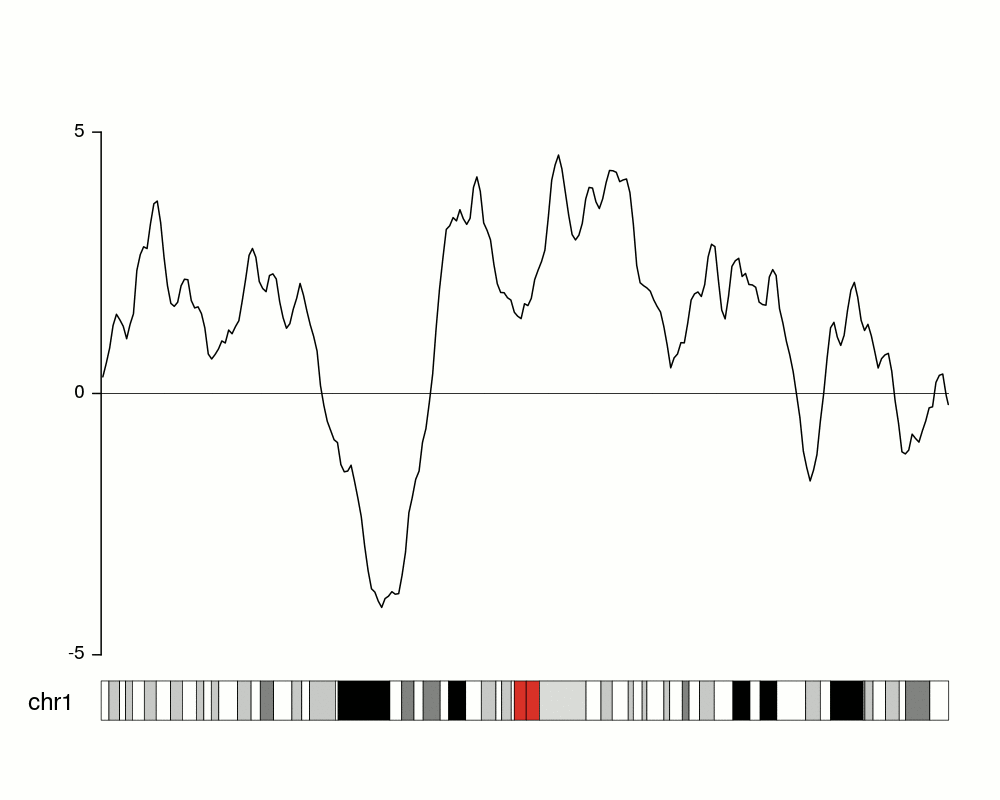

```{r setup, include=FALSE}
knitr::opts_chunk$set(echo = FALSE)
```

# 1. R packages used in this exercise

The following R packages are used in this exercise:

- *tidyverse*: Package is loaded to use functions to import, tidy, manipulate and visualize the data.

- *rmarkdown*: provides the function "paged_table()" which provides a good view of the data sets in table format.

- *tidyquant*: provides function for extracting financial data from various sources on the web.

- *gghoriplot*: provides "geom_horizon" function that is used to build the proposed data visualization for stock price assessment of top 40 companies by market capitalization.

- *ggthemes*: to use different theme functions for the plots.

They are loaded using the code chunk given below. The following code chunk passes the list of packages as a vector that is iterated over using a *for loop{}* and all the packages in the vector are loaded. The *if()* condition ensures that the packages get installed on running the code chunk, if they are not already installed. Overall, the code chunk checks all the boxes when it comes to using any number of packages in R with ease.

```{r, echo = TRUE, warning = FALSE, message = FALSE}
packages = c('rmarkdown','tidyverse','tidyquant','ggHoriPlot', 'ggthemes')
for(p in packages)
{
  if(!require(p,character.only = T))
  {
    install.packages(p)
  }
  library(p,character.only = T)
}
```

# 2. Data Preparation

## 2.1 Loading the Dataset

To plot the stock prices of top 40 companies, the list of top companies by market capitalization was downloaded from this [link](https://companiesmarketcap.com/singapore/largest-companies-in-singapore-by-market-cap/) and saved as a *csv* file. 
Subsequently, the *csv* file was loaded into an R data frame "topcompanies" using the "read_csv()" function from the "tidyverse" package. Then, using *boolean masking* on the "topcompanies" data frame, "which()" function and condition that the "Rank"(ranks the companies based on their market capitalization) field from the data frame is less than 41, top 40 companies data filtered and was saved into another data frame "top40companies".

```{r, echo = TRUE, warning = FALSE, message = FALSE}
topcompanies <- read_csv("data/top40companies.csv")
top40companies <- topcompanies[which(topcompanies$Rank<41),]
```

## 2.2 Scraping stock price data using "Tidyquant" package

The stock prices were scraped using "tq_get()" and "tq_transmute()" functions from "tidyquant" package in R. The "tidyquant" package is designed for modeling and scaling analyses using the the "tidyverse" tools. The "tq_get()" function is a one-stop shop to get quantitative data from various web-sources."tq_transmute()" function is to perform and scale financial calculations completely within the "tidyverse".

The way these functions are used is getting stock prices for each of the top 40 companies by market capitalization using *for loop*. The arguments *from* and *to* are specified in "tq_get()" as required, "2020-01-01" and "2021-12-31" respectively and arguments *select* to select the fields "date" and "adjusted" in "tq_transmute()" function and the *period* argument to "days" as we need to get daily stock prices. "adjusted" stands for adjusted stock price, the adjusted closing price amends a stock's closing price to reflect that stock's value after accounting for any corporate actions. It is often used when examining historical returns or doing a detailed analysis of past performance.

The stock prices data is not recorded for 01 Jan 2020 as trading does not happen on the first day of the year. The stock price for the minimum date for each stock is recorded in the variable "initial_price" and "rep()" function is used to repeat the minimum date for the length of stock price data for each stock, specified in the "times" argument in the "rep()" function. The stock symbol is also recorded as "symbol". Subsequently, the data frames for each stock are concatenated using the "rbind()" function. The combined data set "stock40daily" with fields shown below using the "paged_table()" from the "rmarkdown" package in R. This function allows pagination of rows and columns of a data set.

```{r, echo = TRUE, warning = FALSE, message = FALSE}
stock40daily <- data.frame()

for (x in top40companies$Symbol){
stock_data_daily <- tq_get(x, 
                           get = "stock.prices",
                           from = "2020-01-01", 
                           to = "2021-12-31") %>%
                    tq_transmute(select = c(date, adjusted), 
                           mutate_fun = to.period, 
                           period  = "days")
  
stock_data_daily$initial_price = 
  rep((stock_data_daily$adjusted[which(stock_data_daily$date==min(stock_data_daily$date))]), 
                               times = nrow(stock_data_daily))

stock_data_daily$Symbol = x
stock40daily <- rbind(stock40daily,stock_data_daily)
}

paged_table(head(stock40daily))
```

Then, to ascertain the performance of stocks, percentage change in stock prices is calculated from the initial date in the time-period 01 Jan 2020 to 31 Dec 2021 and saved in the field "change_from_initial". For this "mutate()" function from "tidyverse" package is used and the percentage change is calculated as:

change_from_initial = ((adjusted - initial_price)*100)/initial_price

This method is chosen to assess the performance as it scales the stock performance on the same scale and enables users to view the changes based on a single starting point and is a common method to assess stock performance (refer to the references section).

```{r, echo = TRUE, warning = FALSE, message = FALSE}
stock40daily <- stock40daily %>%  mutate(change_from_initial = round(((adjusted-initial_price)/initial_price)*100,2))
paged_table(head(stock40daily))
```

# 3. Horizon Plots

To visualize the time series stock price data of top 40 companies, the relatively new and lesser known time series visualization "Horizon plot" will be used. 
Horizon plots (usually called horizon graphs) are a type or plots frequently used in time-series data to represent a moving value in a fraction of the vertical space required by a standard line or area plots. This is most useful when plotting and comparing different moving values.
In short, it cuts the data in different bands on the y axis and assigns a different color to each band, giving a more intense color to the values farther from 0. Positive and negative values are given different colors. After that, negative values are mirrored on 0 and finally all bands are plotted on top of each other, so the more intense bands representing higher values are drawn above the lower values. *fig.1* displays an animation explaining how the horizon plots are created step by step in the back-end.

{width=70%}

# 4. Proposed Visualization

Now that we know what horizon plots are and how they represent the data, here is the proposed sketch to represent our required visualization.

{width=70%}

# 5. Final Visualization

## 5.1 Building the visualization

To build the proposed visualization in R, "geom_horizon()" function from the "gghoriplot" package is utilized. This function builds horizon plots in ggplot2. It allows for the customization of the origin and the horizon scale.
The arguments used in the function are explained below:

- *aesthetics*: "date" is chosen as the x-axis variable and "change_from_initial" is the y-axis variable.

- *horizonscale*: This argument is used to specify the cut-points of the horizon plot. It can either be an integer specifying the number of ranges (default is 6), or a user-supplied numeric vector with the cut-points defining the different ranges as per the official documentation. In our case, we cannot practically specify the numeric values for cut-points as a vector since the scale of the y-axis varies for each stock. Therefore, an integer value of 8 is specified, which will split the area plot into 4 regions for the 4 quantiles of negative and positive value ranges each.

- *origin*: It represents the origin of the horizon plot. It can either be a string, namely "midpoint" (the default), "median", "mean", "min" or "quantiles", or a user-specified number. In our case, I have specified it as "quantiles" such that the origin of the plot is the median (median is used as the origin because the stock price data are skewed for the stocks) and the cut-points are quantile values.

Then "facet_wrap()" function is used to get horizon plots for all the 40 companies by passing it "symbol" field as the argument. Apart from this, theme and labeling functions are used to provide details about the plot. 

The "scale_x_date" function is used to set the date labels on the x-axis. Here, the label is month year format, and 1 month interval is used to set the breaks.

"labs()" function is used to specify text for the *title*, *sub-title*, *x-axis* and *y-axis* for the plot. 

"theme_few()" is used to keep the background devoid of grids and "theme()" function is used to specify the font size, orientation for the labels and the legend, the "panel_border" and "panel.spacing.y" are set to 0 and blank respectively so that the panels look like part of the same plot and there is no hindrance when comparing the performance of difference stocks. 

```{r, echo = TRUE, warning = FALSE, message = FALSE, fig.height=12, fig.width=18}

fig <- stock40daily %>% ggplot() +
  geom_horizon(aes(date, 
                   change_from_initial),
                   horizonscale = 8
                   , origin = 'quantiles') +
  scale_fill_hcl(palette = 'PiYG') +
  facet_grid(Symbol~.) +
  scale_x_date(expand=c(0,0), 
               breaks = "1 month",
               minor_breaks = "1 day",
               date_labels = "%b%y")+
  theme_few()+
  labs(title = 'Price changes for top 40 Stocks by Market Capitalisation from 01 Jan 2020 till 31 Dec 2021', 
                     
subtitle = 'Most of the Stocks took a fall during March 2020 - the onset of COVID-19 Pandemic',
                     
       x = 'Date', 
       y ='% increase in stock price compared to initial price')+
  theme(
    plot.title = element_text(size=24),
    plot.subtitle = element_text(size=22),
    strip.text.y = element_text(size = 16, angle = 0, color = "black"),
    axis.text.y = element_blank(),
    axis.title.y = element_text(size = 18, color = "black"),
    axis.title.x = element_text(size = 18, color = "black"),
    axis.ticks.y = element_blank(),
    axis.text.x = element_text(size = 10, color = "black"),
    panel.spacing.y=unit(0, "lines"),
    panel.border = element_blank()
    )
fig
```
*fig.3: Horizon Plot for Stock prices of top 40 companies*

## 5.2 Major Observations

Dark Pink patches around March 2020 tell us that stock prices of all the top 40 companies fell during March 2020 compared to the beginning of the year 2020, which corresponds to the onset of COVID-19 pandemic and lockdown in global economies.

The green areas start appearing around Nov 2020. This tells us that stock prices of all of the companies recovered compared to the beginning of 2020 which corresponds to easing of COVID-19 related movement restrictions world-over. However, the shading of colors differs for different stocks, some stocks have recovered comparatively more quickly represented by dark green areas, others have light green areas suggesting those companies recovered comparatively slowly.

## 5.3 Plotly Error

To depict the actual values of percentage changes in stock prices over time for these companies, "ggplotly()" function was tried, but the error message tells us that "geom_horizon()" is yet to be included in the "plotly" package in R. The request submission link is also provided by R where the request for inclusion of "geom_horizon()" into "plotly" was made. Apart from this, various tooltip options were also explored, there is an "add_tooltip()" function in R but that can only be used with RShiny. 

```{r}

#ggplotly(fig)

```

{width=70%}

# 6. Conclusion

It can be concluded that horizon plots are useful for representing time series data in general for multiple categories and ascertaining the performance of multiple stocks over time in particular. It provides a lot of information in very little space and effectively represents the appropriate amount of information when we are looking to visualize and analyse timeseries data on the same time scale for multiple categories.

## References: {.appendix}

1. Horizon plot tutorial- [Bernatgel Github](https://bernatgel.github.io/karyoploter_tutorial/Tutorial/PlotHorizon/PlotHorizon.html)

2. Investopedia - [Adjusted Closing Price](https://www.investopedia.com/terms/a/adjusted_closing_price.asp#:~:text=Key%20Takeaways-,The%20adjusted%20closing%20price%20amends%20a%20stock's%20closing%20price%20to,price%20before%20the%20market%20closes)

3. Horizon Plots office Documentation [R](https://cran.r-project.org/web/packages/ggHoriPlot/ggHoriPlot.pdf)

4. Time on the Horizon [article](http://www.perceptualedge.com/articles/visual_business_intelligence/time_on_the_horizon.pdf)

5. Development of Horizon Plot [Link](http://citeseerx.ist.psu.edu/viewdoc/download;jsessionid=08076DD0A1346CB0F3AE2A98A5FB17A0?doi=10.1.1.363.5396&rep=rep1&type=pdf)
