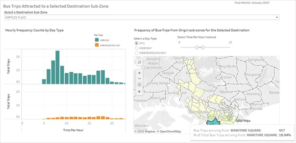
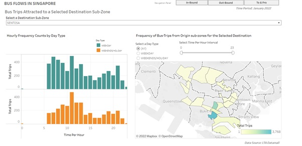

```{r setup, include=FALSE}
knitr::opts_chunk$set(echo = FALSE, warning = FALSE)
```

# 1. Overview

The article aims to fulfill the tasks listed in the [article](https://isss608-ay2021-22t2.netlify.app/dataviz/dataviz2) using **Tableau Desktop 2021.4**.
The tasks refer to a given interactive data visualization dashboard for the Singapore's inter and intra-zonal public bus flows at the planning sub-zone level for January 2022. This article aims to critique the interactive data visualization dashboard on various aspects of clarity, aesthetics and interactive design.
Additionally, the article also aims to infer the objectives of given visualization and assess whether it fulfills those objective appropriately. Thereafter propose an improved visual dashboard to fulfill the inferred objectives and add additional features to improve the data analysis and give more insights into the data.

### The Tasks

The tasks fulfilled in this article inlcude the following:

  1. Critic the data visualisation from its clarity, aesthetics and interactive design. At least three from each evaluation criterion.
  
  2. With reference to the critics above, suggest alternative graphical presentation to improve the current design. Sketch out the proposed design. The proposed alternative design should include appropriate interactive techniques. Support your design by describing the advantages or which part of the issue(s) your alternative design try to overcome.
  
  3. Using Tableau, design the proposed data visualisation.
Provide step-by-step description on how the data visualisation was prepared.

  4. Describe three major observations revealed by the data visualisation prepared.

# 2. Given interactive visualization

The [given interactive data visualization](https://public.tableau.com/app/profile/tskam/viz/prototype1_16468762782120/Dashboard1) is prepared using data from the following sources:

  1. origin_destination_bus_SZ_202201.csv, this data set was downloaded from LTA Datamall and URA region, planning area and planning sub-zone information were added by using GIS Overlay operation.
  2. MP14_SUBZONE_WEB_PL, this data provides URA Master Plan 2014 Planning sub-zone boundary map in ESRI shape file format. It was downloaded from data.gov.sg.


# 3. Introduction

The data set 'origin_destination_bus_SZ_202201.csv' contains over 5 million records along 13 dimensions. But from the given visualization, represented in figure 1, it can be concluded that following are the relevant dimensions for the purpose of completing the tasks mentioned earlier- 

  1. "Time per Hour" - Represents the time in a day by the hour as whole numbers starting from 0 corresponding to time 12 am to 23 corresponding to time 11 pm.
  
  2. "Day Type": Represents whether the day is a weekday or weekend/holiday.
  
  3. "Total Trips": Represents the number of trips in a given hour in the day given an origin sub-zone and a destination sub-zone.
  
  4. "Origin Sz": Represents the origin sub-zone for a bus-trip.
  
  5. "Destination Sz": Represents the destination sub-zone for a bus-trip.
  
The "Year Month" variable has only one unique value "2022-01" which means the bus-trips mentioned in the data set are for the month of January 2022, therefore it can be skipped. Other fields in the data set were not used to prepare given and the proposed data visualizations and hence they were hidden away while preparing the data. 


From the given data visualization, its objectives can be inferred as follows:

  - To represent the number of bus-trips, originating from a user selected origin sub-zone attracted to destination sub-zones, within the sub-zone and across sub-zones in Singapore, for each hour of the day and distinguish the numbers for weekdays and weekends/holidays.
  
  - To represent the number of bus-trips, attracted to a user selected destination sub-zone, originating from origin sub-zones, within the sub-zone and across sub-zones in Singapore, for each hour of the day and distinguish the numbers for weekdays and weekends/holidays.
    
  - To represent the number and percentage of bus-trips happening between all the origin sub-zones and destination sub-zones.

Furthermore, it can also be inferred that the outcomes of the prepared data visualizations should be useful in decision making, for the travelers, researchers, academicians as well as the concerned authorities (Land and Transport Authority, Ministry of Transport, Singapore in this particular case). The data visualization dashboard design is proposed and prepared in later sections and step-by-step preparation steps are also provided. The detailed preparation steps can  also be leveraged by the users to reproduce the dashboard for their specific use-cases mentioned below:

  - For geographical regions other than Singapore.
  
  - For modes of transport other than buses. 
  
  - For variables other than trips e.g., volume of trade.
  
  - For time-periods other than January 2022 and across several days of the week, or other time dimensions as suitable.

# 4. Critiques

This section focuses on providing in-depth critics on the given interactive data visualization dashboard. 

The goal of a dashboard is to provide users with an easy way to gain valuable insights for their respective use-cases. Instead of pouring over tons of data, reports or pages, the dashboard provides with a summary that quickly answers questions and tracks key metrics for the users.

Generally, the given data visualization is not informative. It is a good lesson on how despite having a clean and accurate data set, familiarity with an effective data visualization software and a general awareness of data visualization types, the resulting data visualizations can still be chartjunks if **attention to detail**, **understanding of design principles** and **visual storytelling skill** is missing. 


## 4.1 Clarity
  
### 4.1.1 Missing Dashboard Titles

A title is the most crucial to any piece of information that the user is trying to convey. The given data visualization dashboard is missing a dashboard title. A dashboard Title should be located at the top of the entire dashboard and must contain appropriate *text* and can also contain *image* content if relevant. 

Appropriate text refers to text giving enough details on the contents of the dashboard so that the user knows what she/he can expect to see in the dashboard and decide whether the dashboard is useful or not for their viewing rather than navigating through the entire dashboard and wasting their time to conclude that the dashboard does not provide information they are looking for.

The dashboard title should attract users at the same time provide the following information:

 - Main title should clearly mention the common fields used across all the visualizations in the dashboard and the time period in discussion. 
 
 - Sub-title can also be mentioned to represent either the overall purpose of the dashboard or interesting key insight(s) that the users can find in the dashboard.
 
### 4.1.2 Incomplete field name - "Weekends/Holidays"

In Figure 2, it can be seen that the field names, highlighted in red boxes, on the y-axes are incomplete for the bar plots in the lower half of the figure 2. 

{width=80%}


The complete field name is captured from the data set and represented in figure 3. 

{width=40%}


The field name is "Weekend/Holidays" is not fully captured in the data visualization leading to lack of clarity on what the field refers to. In this case, the users might confuse bus-trips that take place on a holiday that falls on a weekday to be counted in the "WEEKDAY" plots leading to misinterpretation. This is because they cannot see that the weekends and holidays are actually combined and represented separately in the "WEEKENDS.." plots.


### 4.1.3 Lack of Clarity in the Adjacency Matrix plots

  a) **Title of the Weekend Adjacency Matrix is incomplete**: As mentioned earlier in section 4.1.2, for the "Weekend Adjacency Matrix" chart, the keyword "weekend" is not representative of the data for the field "Weekends/Holidays". It leads to misinterpretation of the data visualizations. 

  b) **Titles for both the plots lack clarity**: The titles for both the adjacency matrices do not mention what the matrix intersections represent until one hovers over the points on the matrices.
  
  c) **Lack of clarity in the Tool tips**: The text, "% of Total Total Trips along Table (Across)" is ambiguous as it does not reflect the variable this percentage is for. It would be appropriate to change it to ‘% of Total Bus-Trips from the Origin Sub-zone’. 
  
### 4.1.4 Existence of NULL Values for the Origin and Destination sub-zones

The dashboard gives the users an option to select NULL origin and destination sub-zones.
The NULL Values for the origin and destination sub-zones were explored and it was found that the most of the NULL origin sub-zones do correspond to non-null destination sub-zones and most of NULL destination sub-zones correspond to non-null origin sub-zones. Apart from this, some of the records have NULL values for both the origin and destination sub-zones. This creates a lot of ambiguity.

### 4.1.5 Lack of mention of the time period

There is no mention of the time period for the data represented in the dashboard, which contributes to lack of clarity and the users cannot make any meaningful conclusions from the observed findings or they might end up generalizing the derived insights for time periods.

### 4.1.6  Lack of dashboard caption

There is no mention of the source of data in the caption. This makes it unclear to the user as to whether the charts comes use a reliable data source or not.

## 4.2 Aesthetics

The aesthetics of the given dashboard clearly need improvement. The specific issues are mentioned below:

### 4.2.1 The Alignment of the bar-chart and the adjacency matrix

The bar-chart and the adjacency matrix are not aligned on the same horizontal level which makes the overall look a bit off. The bar charts for bus trips from origin sub-zone and bus trips to destination sub-zone are also misaligned as the top and bottom lines are not on the same level horizontally resulting in poorly organised view of the dashboard.

### 4.2.2 The positioning of the filter selections and legends is inappropriate

The filter selections for the destination and origin sub-zones belong to the bar-charts and should be placed next to their respective bar charts appropriately. The legend belongs to the adjacency matrix and should be placed within the chart area for the chart to look good.

### 4.2.3 The type of filter selection gives a cluttered view

The filter selection single list type is not appropriate for over 300 sub-zones and makes the view cluttered with unnecessary scrolling within the dashboard.

### 4.2.4 Color choice for the adjacency matrices is not appealing

The color choice for the adjacency matrices is single sequential color, which shows white for lower values and black for higher values. For the lower values, the user will not be able differentiate between the white background and the data points. Additionally, the colors used are not appealing visually. For the higher values, most of the adjacent points have the same color, making it hard to distinguish. It results in poor design and fails to attract users.

### 4.2.5 The sizes of the 2 adjacency matrices is different

The sizes of the weekday and weekends/holidays adjacency matrices are different, the weekday one is bigger and the weekends/holidays one is smaller as shown in the figure below. This looks inappropriate and degrades the aesthetics of the dashboard.

{width=30%}

### 4.2.6 The size of the adjacency matrices is too small

The size of the adjacency matrix is too small for the users to differentiate one point on it from the other. This makes it very difficult for the users to navigate through the matrices and find the information they want to look at. While this degrades clarity, it also degrades the aesthetics. 

### 4.2.7 The y-axis titles for the bar-plots is incorrectly aligned

The y-axis titles are aligned horizontally which wastes horizontal space, leads to missing text and does not look appealing.

### 4.2.7 The labels on the x-axis for the bar-plots do not start from 0

The x-axis on the bar-plot represents time per hour and its values range from 0 to 23. In the given visualization the x-axis labels start from 6 suggesting that the axis ticks need to be set to fixed from 0 to 23.

## 4.3 Interactivity

### 4.3.1 Incorrect filter selection for the bar-plots

Single selection list type filter is not appropriate for so many data points, instead single select drop down list is better as it will it easier for the users to search for the sub-zone they are interested in. 

### 4.3.2 Repetitive text in the tooltips for the bar-plots

The text in the tool tips for the bar plots contains "Day-Type" and "Time per Hour" is repetitive as the day-type and time per hour are already displayed on the plots. The only information required to be displayed is the number trips as they cannot be exactly matched to the numbers of the y-axis. The time per hour can be exactly matched as there is only one bar for each hour.

### 4.3.3 Ambiguity in the tool tip for the adjacency matrix

The text, "% of Total Total Trips along Table (Across)" is ambiguous as it does not reflect the variable this percentage is for. It would be appropriate to change it to ‘% of Total Bus-Trips from the Origin Sub-zone’.

### 4.3.4 Incorrect chart-type for displaying the percentage of bus-trips

Adjacency matrix is not the correct type of chart for plotting the percentage of bus-trips from an origin sub-zone as the number of sub-zones is over 300. So many data points are difficult to view and interpret even with interactivity. 

### 4.3.5 Lack of interactivity

The plot only allows the users to choose 1 origin sub-zone and 1 destination sub-zone and there are tool tips on the charts. The charts use various features which can be used as filters to provide flexibility to the users to make selections for the hourly intervals.


# 5. Proposed Data Visualization Dashboard


The proposed interactive data visualization dashboard was prepared using Tableau software. The proposed dashboard contains 3 different tabs. The details and functions are mentioned below:

  1. **In-Bound Tab**: This tab is designed for users to select a destination sub-zone of their choice and for the selected destination sub-zone, it displays 2 charts. One is a frequency bar-chart with two facets showing the number of trips arriving at the selected destination by the time per hour in the day, for weekday and weekends/holiday. The second chart is a sub-zonal geo-spatial area map of Singapore. It displays the number of trips arriving at the selected destination from each of the sub-zones and the percentage of total trips arriving from each sub-zone through use of colors and tool tip. For the geo-spatial chart, the user can select the day type and time per hour of their interest based on insights derived from the first chart or independently. 

  2. **Out-Bound Tab**: This design and functionality of this tab is exactly the same as the first tab, just the content and results differ. Instead of selecting a destination sub-zone, the user selects an origin sub-zone to look at the number of trips from this sub-zone to various destination sub-zones across Singapore.

  3. **To & Fro Tab**: This tab enables users to compare the number of trips originating from one or multiple sub-zones of their choice for weekday and weekdays/holidays with each other and with the number of trips attracted one or multiple sub-zones for weekday and weekdays/holidays. They can also choose the time per hour of their choice by moving the given slider tab. This allows users to view the frequency of bus-trips originating from and attracted to various sub-zones and compare them in several ways:
  
      - Compare number of bus-trips originating from one sub-zone with one or more other sub-zones.
    
      - Compare number of bus-trips attracted to one sub-zone with one or more other sub-zones.
    
      - Compare the weekday and weekends/holiday frequencies for the cases a & b mentioned above and across these two cases.


Both the tabs are same in the design except one is for In-Bound traffic to a Destination sub-zone and the other is for Out-Bound traffic from an origin sub-zone.

{width=70%}


{width=70%}


The final visualization can be found here- [Bus Flows in Singapore at Planning Sub-Zone Levels](https://public.tableau.com/app/profile/karishma.yadav2567/viz/BUS-TRIPSACROSSPLANNINGSUB-ZONESSINGAPORE/DestinationSub-Zone?publish=yes).

The screenshots of the tabs are displayed here:

{width=70%}

{width=70%}

{width=70%}

The proposed dashboard is better than the given dashboard in the following ways:

  1. **Clarity issues addressed by the proposed dashboard**: In terms of clarity, the proposed dashboard addresses the following issues:

      - It has detailed titles for all the components including the dashboard, the tabs and the individual charts which improves clarity about the contents of the dashboard.
  
      - It provides the users with clear directions on how to navigate through the dashboard by mentioning proper titles for the filters and legends. In the given visualization, the filters and labels are merged together, the users cannot identify how to interact with the dashboard.
      - It removes null values to avoid ambiguity.
  
      - It transforms the adjacency matrix into geo-spatial plots where users can choose the origin sub-zone of their choice and look at the number and percentage of bus-trips attracted to each of the destination sub-zones. The clarity is improved in the sense that, in the adjacency matrix, the users cannot directly find the origin sub-zone they want to see the % of total bus trips attracted to each of the destination sub-zones, they can neither easily navigate to the destination sub-zone they want to look at. The adjacency matrix tooltip also does not mention the number of trips, which would have been useful for the users. Geo-spatial plot with color legend for the number of trips and tool tips for the percentage of trips attracted to each destination makes the information easy to access and gives clarity on the number of trips as well. 
  
      - The proposed design places each of the filter selections and legends for their respective plots to avoid any confusion.

  2. **Aesthetics issues addressed by the proposed dashboard**: The aesthetics have been significantly improved in the proposed dashboard, in the following ways:

      - The positioning of charts are aligned.
  
      - The sizes and aspect ratios of the charts are aligned.
  
      -  The legends and filters are organized appropriately.
  
      - The dashboard view fits into the screen.
  
      - The weekday and weekends/holidays bus-trip frequencies are colored in different colors to make the plots easier to view and also look good.
  
      - The number of sub-zone data points on the plot which were in a list format in the given visualization have been changed to drop-down menu to have better aesthetics.
  
      - Tabs have been introduced which eliminate unnecessary cluttering of the dashboard view and make it easy to navigate and better to look at.

  3. **Additional features**: The proposed visualization also proposes additional features into the dashboard for the purposes of increasing interactivity and flexibility and also to provide additional insights the data can provide. Along with a geo-spatial plot for showing the percentage of trips originating from a sub-zone and going to different sub-zones. The dashboard also show the the percentage of trips attracted to a sub-zone and originating from different sub-zones. Along with the percentages, the number of trips are also displayed. Additionally, it introduces the flexibility to choose the hourly time intervals they want to look at.

The dashboard also shows the frequency of bus-trips originating from multiple sub-zones and attracted to multiple sub-zones by day-types parallelly through geo-spatial to enable all the permutations of comparison that can be done across these features along with the choice of selecting the hourly time intervals they want to look at.
  
# 6. Preparing the final visualisation

The final visualization can be found here- [Bus Flows in Singapore at Planning Sub-Zone Levels](https://public.tableau.com/app/profile/karishma.yadav2567/viz/BUS-TRIPSACROSSPLANNINGSUB-ZONESSINGAPORE/DestinationSub-Zone?publish=yes).


### Steps-by-Step Explaination

This section focuses on explaining the step by step process that was used to create the proposed visualization and the various new techniques such as dashboard merging and embedding tableau public links into a dashboard as web pages were explored and implemented. 
The data set file "origin_destination_bus_SZ_202201.csv" contained over 5 million records.

The proposed visualization dashboard proposed geo-spatial charts, which require merging of the "origin_destination_bus_SZ_202201.csv" file with the "MP14_SUBZONE_WEB_PL.shp" file to get the geographic coordinates and geometry for the sub-zones. As the proposed visualisation creates geospatial plots for the origin as well as destination sub-zones to provide a complete picture of the data set and provide more insights, the "MP14_SUBZONE_WEB_PL.shp" was tried to be joined with the "origin_destination_bus_SZ_202201.csv" file twice to equate the "Subzone_N" variable in the former to the "Origin_Sz" and "Destination_Sz" variables respectively. While the joins were successful, the software was taking a lot of time to navigate through and was also crashing several times. Therefore, two different Tableau workbooks are used, in one, "Subzone_N" is equated with "Origin_Sz" and in the other "Subzone_N" is equated with "Destination_Sz". The detailed steps are explained below:

Step 1: Loading the files into Tableau Workbook
The data set files were dragged and dropped from the data folder into the Tableau homepage one by one as shown in the figure below.

{width=70%}

Step 2: Drag and drop the "origin_destination_bus_SZ_202201.csv" to join with the "MP14_SUBZONE_WEB_PL.shp" file that was already selected like shown in the figure below.

{width=50%}

Step 3: The join is invalid as there is no common field name between the two data files and hence tableau cannot auto-detect. Therefore we equate the "Subzone_N" to match with "Origin_Dz" like shown below

{width=50%}


Step 4: The null values in the fields "Origin_Sz" and "Destination_Sz" were explored as shown in the images below and it was considered appropriate to remove due to reasons mentioned earlier.

{width=50%}

{width=90%}


{width=90%}


Step 5: The NULL values were filtered away using the filter tab in Tableau for the "Origin_Sz" and "Destiantion_Sz" fields. The steps are explained in the figure below.

{width=60%}

{width=40%}


Step 6: Unnecessary fields from the "origin_destination_bus_SZ_202201.csv" file were selected and hidden away as shown in the figure below. This was done to avoid having too many variables to navigate through. The variables kept were - "Origin_Sz", "Destination_Sz", "Total_Trips", "Time Per Hour" and "Day-Type" as these will be used in creating the data visualization dashboard that is proposed.

{width=50%}


Step 7: Moved to create a Sheet, then dragged and dropped the "Latitude" and "Longitude" fields in the "Rows" and "Columns" respectively to get the world map view. The screenshot is shown in the figure below.

{width=50%}

Step 8: Added Geometry to the Details to get the sub-zone areas in Singapore as shown in the figure below.

{width=50%}

Step 9: Then the field "Total Trips" was dragged and dropped to the "Color" Mark to get the areas colored as per the number of bus-trips. Subsequently, the "Origin_Sz" field was dragged and dropped to the "Details" Mark. The steps are shown in the figure below.

{width=50%}

Step 10: Subsequently "Destination_Sz", "Day Type" and "Time Per Hour" were moved to the the Filters pane, as shown in the figure below.

{width=50%}

Step 11: "Show Filter" option was selected from the drop-down menu that appeared on clicking the upside down triangle on the filter variables and appropriate filters were selected as shown in the figures below.

{width=40%}


Step 12: Filter types for the "Day Type" and "Destination_Sz" were changed as shown in the figure below.

{width=40%}


Step 13: The Filter Title names were changed appropriately, the exact names can be found in the dashboard. The Edit Title tab was selected from the drop-down menu that appears on clicking on the filter options. After that a dialog box appears where the text can be specified and formatting of the text can be done as required. 

{width=40%}


{width=40%}


Step 14: The Sheet title was changed by clicking on the Sheet name box, after which a dialog box appeared where the text was specified and formatted as shown in the figure below.

{width=70%}


Step 15: Then the "Total Trips" field was added to the "Details" mark and a quick table calculation was added to create the "% of total trips from the origin sub-zone" which will add this variable in the tooltip for each of the origin sub-zones for the selected destination sub-zone.

{width=50%}


Step 16: The Tooltips in the Marks pane was double clicked and the tooltip details were changed as shown in the figure below.

{width=50%}

{width=50%}


A new workbook was created parallely where the two data sets were joined by equating the "Subzone_N" and "Destination_Sz" fields. Then Steps 1-16 were repeated to create the same plot for getting the frequency of bus-trips to destination sub-zones for the selected origin. The only Change was in place of selected the "Origin_Sz", "Destination_Sz" was selected and in place of "Destination_Sz","Origin_Sz" was selected.
The final view of the chart is shown below.

{width=50%}


Step 17: A new sheet was created and the fields "Day Type", "Time Per Hour" and "Total Trips" were moved to rows and columns as shown in the figure below.

{width=50%}


Step 18: Added "Destination_Sz" as the filter and changed filter type, also added the "Day Type" as color and change color by clicking on the color mark and choosing the colors as required.

{width=50%}


Step 19: Edited the "Time Per Hour" axis by right clicking on it and selecting fixed ticks and setting the range from 0 to 23 as shown in the figure below.

{width=50%}


Steps 17 to 19 were repeated to create the same chart of "Origin_Sz" in the second workbook.

Step 20: A new sheet was created and various fields were used as shown in the figure below. The "Latitude" and "Longitude" fields were dragged and dropped to the rows and columns respectively. Then "Geometry" field was dragged and dropped to the "Details" Mark. Subsequently, "Total Trips" field was added to the "Color" Mark.
A quick table calculation was done the "Total Trips" field to get the "% of total trips for the selected origin"
Then, "Origin_Sz" and "Time Per Hour" were dragged and dropped to the "Filters" pane. Thereafter, the filter type for the Origin Sub-zone filter was changed to "Multiple Value drop down". Then the filter titles were editing using the "Edit title" that appears in the drop down menu on clicking the filter options.

Eventually the tooltips were edited to shown the result shown in the figure below.

{width=70%}

Step 20 was followed to create the same chart for "Destination_Sz" in the second workbook.

Step 21: Once the 3 sheets were created in the 2 workbooks for the Origin and Destination Sub-Zones respectively, dashboards were created. Creating Dashboard in Tableau is quite intuitive. 

For the purpose of preparing the proposed data visualization, a new dashboard was created using the "+" tab for dashboard. Then the following dashboards were created.

  - Workbook 1: In the workbook 1, two dashboards were created:
  
    - "In-Bound Traffic to Destination Sub-Zone": The worksheet for the barplots was dragged and dropped on the dashboard area towards the left and then the worksheet for the "Frequency of Bus-Trips from Origin sub-zones for the Selected Destination" worksheet was dragged and dropped on the right. Subsequently, the "Select a Destination Sub-Zone" filter from the second work-sheet was linked to the same for the bar-plot worksheet by choosing "Apply to worksheet" option that appears when the filter options on the filter is clicked and "Bar-plots" sheet is selected. Then several adjustments were made to organise the content which involved just dragging and dropping the components around the dashboard to make it look like what is shown in figure 36.
    
    - "Trip Frequency Map for Destination Sub-Zone": Was prepared using the trip frequency map worksheet by simply creating a new dashboard and dragging and dropping the sheet on it and organizing the contents as shown in figure 37.
  
  - Workbook 2: 2 dashboard were created in this workbook too.
  
    - "Out-Bound Traffic From Origin Sub-Zone": Steps similar to the dashboard one in workbook 1 were followed to create the dashboard shown below, using the same steps as shown in figure 36.
    
    - "Trip Frequency Map for Origin Sub-Zone": Steps similar to the dashboard two in workbook 1 were followed to create dashboard, the steps followed were same as shown in figure 37.
    
    
{width=70%}
    
{width=70%}

Step 22: The dashboards "In-Bound Traffic to Destination Sub-Zone", "Out-Bound Traffic From Origin Sub-Zone", "Trip Frequency Map for Origin Sub-Zone" and "Trip Frequency Map for Destination Sub-Zone" were published on Tableau public following the steps shown in figure 38 below. I was already logged into Tableau public, if you are not, then login is required. Then click Save when the dialog box shown in figure 39 appears, to publish the dashboard. Same steps were followed to publish all the 4 dashboards.

{width=70%}

{width=50%}


Step 23: An embedded web-page link was created for the "Trip Frequency Map for Origin Sub-Zone" dashboard by adding "&:toolbar=no&:showVizHome=no&embed=true" extension to the dashboard share link on Tableau found following steps shown in figure 40. This link was used to add this as a webpage object to the "Trip Frequency Map for Destination Sub-Zone" dashboard following steps shown in figure 41, then publish it, to get a combined dashboard as shown in the figure 42 below.

{width=70%}

{width=70%}


{width=70%}


Step 24: Step 23 was repeated to create a tableau embed link for the "Out-Bound Traffic From Origin Sub-Zone" dashboard and this was pasted in the workbook 1 which has the "In-Bound Traffic to Destination Sub-Zone" dashboard. Along with it the dashboard "Bus-Trips across Planning sub-zones in Singapore by Day Type" created in step 23 was also added as another dashboard by copy and pasting the dashboard across sheets. The dashboards were renamed for ease of interpretability, as follows:

  - "In-Bound Traffic to Destination Sub-Zone" was renamed to "Destination Sub-Zone"
  
  -"Out-Bound Traffic From Origin Sub-Zone" was renamed to "Origin Sub-Zone"
  
  - "Bus-Trips across Planning sub-zones in Singapore by Day Type" dashboard was renamed to "Total Bus-Trips"

Step 25: At the final step, we had 3 dashboards mentioned in step 24. 3 navigation buttons were created on all 3 dashboards following the steps listed in the figure below.

  - For the **In-Bound tab**, the "Navigate to" was set as the "Destination Sub-Zone" for viewing the charts for a selected Destination Sub-Zone as shown in figure 43.
  
  - For the **Out-Bound tab**, the "Navigate to" was set as the "Origin Sub-Zone" for viewing the charts for a selected Origin Sub-Zone. The steps followed were same as shown in figure 43.
  
  - For the **To & Fro** tab, the "Navigate to" was set as the "Total Bus-Trips" for viewing the charts for a selected Origin & Destination Sub-Zones. The steps followed were same as shown in figure 43.

{width=70%}

The final results for the tab are already shown in figures 7, 8 & 9. One of the dashboards was selected and published on tableau public, any one can be selected as all the 3 are linked through the navigation buttons and the final visual dashboard was ready. Ta-da!

For the understanding how to embed a webpage object on a Tableau dashboard, steps demonstrated in the Youtube [video1](https://www.youtube.com/watch?v=nWXK4sMspwo) were followed. And for understanding how to add navigation buttons, steps demonstrated in the Youtube [video2](https://www.youtube.com/watch?v=u9OUyZy_d8M) were followed.


# 7. Observations

For optimum view, the dashboard is suggested to be opened in desktop or laptop screens as the dashboard sizes were set to fixed to contain the entire view of different components within one screen.

The dashboard can be utilized by users to study the bus flows for various sub-zones in Singapore and identify the sub-zones for business, those for leisure and recreation and those where the most number of individuals are residing or visiting to and fro during different day types and hours of the day for month of January 2022. The general assumption while making these observations is that the bus-flows in Singapore are in correspondence to the passenger traffic.

1. The general trend is that the number bus-trips to & fro a sub-zone are higher for weekdays as compared to weekends for all the sub-zones. Which also makes sense as on weekdays, people have to travel around for work. While on weekends, they have the option to sit back home and relax.

2. **Raffles Place** is a sub-zone under the Downtown Core Planning Area. 
From the bar plots in figure 44, the number of Bus-Trips attracted to this place in the morning hours between 8 and 10 on weekdays is the highest, while the same trend is not observed for weekends/holidays suggesting that this a business sub-zone with many offices.
From the map on right, it can be observed that most of the trips coming to Raffles place are from the areas close to its proximity. The highest from Maritime Square, suggesting that this is the area where most of the people working in Raffles place are residing. The frequency of bus-trips to raffles place from farther sub-zones such as Senja and Saujana are very few for the month of January 2022.

{width=85%}

For the weekday evenings, it can be seen in figure 45 that most of the trips originating from Raffles are between 5-7 pm which corresponds to the time-period when most of the office close for the day. It can be seen that the people linger in the area till 8pm, suggesting that perhaps some offices close later or the people leave after hanging out for a bit for dinner.

{width=85%}

4. We can look at **Changi Airport**, to study the trends for international commute.

From the figures given below, it can be observed that the morning and evening peak of inbound and outbound bus trips respectively corresponds to workforce commuting to and from the airport. This suggests there is a lot of outflow of individuals to other countries for work and a lot of outflow from Changi Airport to various sub-zones in Singapore in the mornings of weekdays suggests people arriving back. Whereas this trend is consistent for the weekends/holidays.
Interestingly, the trips on weekends are quite low, this could be due to the border restrictions and lingering pandemic fear that people are not travelling for leisure and tourism as the time period in question is January, that is when the Omicron variat of the Coronavirus was at its peak.

{width=100%}

{width=100%}


5.	In case of **Sentosa** an interesting trend has been observed as shown in the figure given below, where the number of inbound trips on weekend around 11 am is same as on weekdays. This tells us that the place is a popular spot for recreation. 

{width=100%}


6. **Tampines East** appears to be the most popular sub-zone, from where majority of the buses originate as well as terminate. Also majority of the buses that start at Tampines east also terminate at Tampines east. There is not particular popular hourly interval in the day that can be singled out for Tampines. This suggests that Tampines could be a densely populated sub-zone.

{width=100%}

{width=100%}
 
7. Another key interesting observation is that the sub-zones with the largest and the second largest areas - "Western Water Catchment" and "Central Water Catchment" do not receive the highest bus-flows but rather they receive much below the average number of bus-flows across all the sub-zones because of the nature of the two sub-zones. 

The above are only a few observations, the dashboard can be used to actually study bus-flows across each and every sub-zone.

# 8. References

1. Kam Tin Seong, "Information Dashboard Design"
2. VizConnect, YouTube, "VizConnect Embedding dashboards within another Tableau dashboard"
3. Jellyman Education, Youtube, "Switch Between Dashboards in Tableau | How to Use Buttons!"
4. Ji Soo Yi, Youn ah Kang, John T. Stasko, Member, IEEE, and Julie A. Jack, Toward a Deeper Understanding of the Role of
Interaction in Information Visualization
5. CHRIS NORTH- AND BEN SHNEIDERMAN, Snap-together visualization: can users construct and
operate coordinated visualizations?
6. Ben Shneiderman, The Eyes Have It:
A Task by Data Type Taxonomy for Information Visualizations
