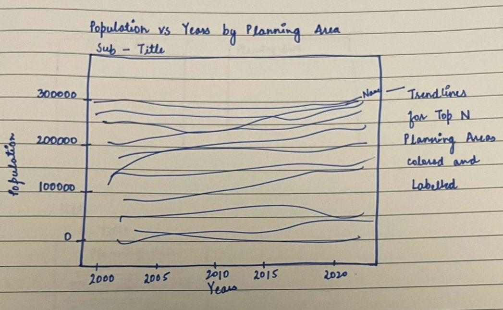
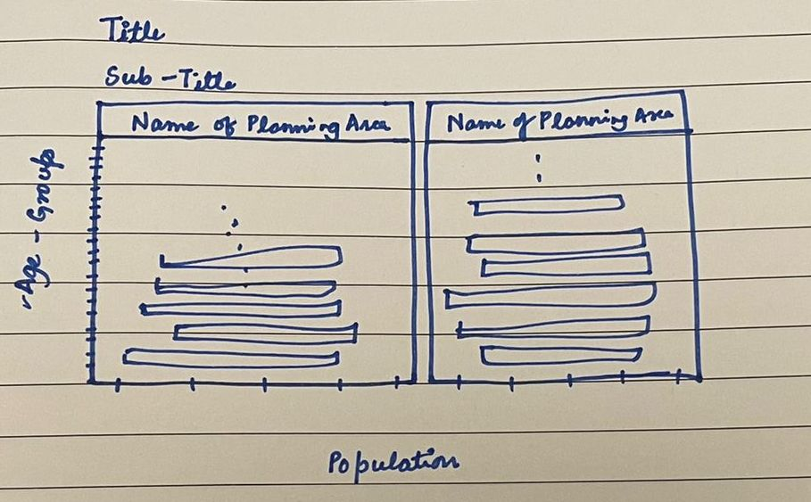

```{r setup, include=FALSE}
knitr::opts_chunk$set(echo = FALSE, warning = FALSE)
```


### R packages needed for the exercise
The following packages in R will be required to use various functions offered by them for data preparation and data visualizations. *plotly* package is used to create the animated and interactive plots in R.

```{r, echo = TRUE, warning = FALSE, message = FALSE}
packages = c( 'knitr','plotly','tidyverse')
for(p in packages)
{
  if(!require(p,character.only = T))
  {
    install.packages(p)
  }
  library(p,character.only = T)
}
```

# Data Prepartion
Two data sets, one containing Singapore population data for the time period 2000 to 2010 and the other containing the same for the time period 2011 to 2020 are imported and viewed as follows:

```{r, echo = TRUE, warning = FALSE, message = FALSE}
population_2000to2010 <- read_csv("data/respopagesextod2000to2010.csv")
population_2011to2020 <- read_csv("data/respopagesextod2011to2020.csv")

kable(head(population_2000to2010,3), format = "markdown")
kable(head(population_2011to2020,3), format = "markdown")
```
The views of the two data sets tell us that they contain the same fields and can be combined. The data sets are combined using the *rbind* function as follows:

```{r, echo = TRUE, warning = FALSE, message = FALSE}
population_joined <- rbind(population_2000to2010,population_2011to2020)

kable(summary(population_joined[,6:7]), format = "markdown")
```
The summary function on the field "Time" validates that the data sets are successfully combined and contain information for the period 2000 to 2020. The summary on the field "Pop" tells us that a lot of planning areas have zero population for "Time", "Sex" and "AG" fields. The 3rd Quantile is also as low as 10 which suggests that we can remove some of the records from the "PA" field. As a first step, the data set was grouped by Planning area and planning areas with 25 highest population numbers were kept.

```{r, echo = TRUE, warning = FALSE, message = FALSE}
population_grouped <- population_joined %>%
  group_by(PA) %>%
  summarise('Pop' = sum(Pop)) %>%
  ungroup()
population_sorted <- population_grouped[order(population_grouped$Pop, decreasing = TRUE),]  
population_filtered <- population_sorted%>%top_n(25)

#filtering the data set on top 25 Planning Areas based on population
population_final <- subset(population_joined, (PA %in% population_filtered$PA)) 
```

As the next step, the data set was explored for trends in population for each of the 25 planning areas over the years from 2000 to 2020. For this, the data set created above was grouped on the fields "Time" and "PA" as follows:

```{r, echo = TRUE, warning = FALSE, message = FALSE}

# Computing the frequency count using group-by method
population_PAT <-
  population_final %>% 
  group_by(Time, PA) %>% 
  summarise(Pop = sum(Pop)) 
kable(head(population_PAT,5), format = "markdown")

```

Then a plot was sketched and plotted showing the trend of total population changes for planning areas in Singapore.

## Population trends by Planning Areas 2000-2020


```{r, fig.height=7,fig.width=8,echo = TRUE, warning = FALSE, message = FALSE}
#plotting the trend of population by planning areas from 2000 to 2010

pa_pop = ggplot(population_PAT, aes(x=Time, y = Pop, color = PA)) + 
  geom_line() +
  geom_point(color="black",size = 0.5) +  
  geom_text(data = subset(population_PAT, Time == "2020"), aes(label = PA, colour = PA, x = Time, y = Pop), vjust = -.5, size = 1.8) + 
  theme(legend.position = "none") +
  scale_y_continuous(labels = function(x) format(x, scientific = FALSE))+
  labs(title = "Population trend for Planning Regions in Singapore from 2000-2020", 
                     subtitle = "The trends vary with most of the areas having negligible change in the population", 
                     x = 'Year', 
                     y ='Population') 
pa_pop
```

From the above plot, 10 planning areas were chosen based on the  following insights:

  1. Planning areas like Punggol and Sengkang have had rapid growth in population in the given period.
  2. Planning areas like Yishun, Jurong West and Woodlands have had slow population growth in the given time period.
  3. Planning areas like Bedok, Tampines and Hougang have had negligible growth in population for the same period.
  4. Planning areas like Jurong East and Ang Mo Kio have had negative growth in population for the period.

Now the goal is to build interactive and animated Age Sex Population Pyramid plots for the 4 groups of planning areas, to examine the trends on a granular level. A sample sketch of the facet is shown below: 




The data for the proposed visualizations is prepared as follows. Let us begin by setting the order of the "AG" field so that it appears in the order of increasing age groups.

```{r}
# Fixing order of age group
age_order <- unique(population_final$AG)
population_final$AG <- factor(population_final$AG, levels = age_order, ordered = TRUE)
```

Then the data set is grouped on the fields "AG", "Sex", "Time", "PA" and aggregated on Population by taking its sum. 

```{r, echo = TRUE, warning = FALSE, message = FALSE}
population_final <- population_final %>% 
  group_by(AG, Sex, Time, PA) %>%
  summarise('Pop' = sum(Pop)) %>%
  ungroup()
```

To create the population pyramids, a new calculated field "Pop_new" was created. This is to help us align the gender populations on a central axis (population = 0).

```{r, echo = TRUE, warning = FALSE, message = FALSE}
population_final<-transform(population_final,Pop_new=ifelse(Sex == 'Males',-Pop,Pop))
```

Then separate data sets were created for each of the 4 groups defined earlier, using the *subset* function as follows:

```{r, echo = TRUE, warning = FALSE, message = FALSE}
rapid_growth <- subset(population_final, PA %in% c("Punggol", "Sengkang" ))
slow_growth <- subset(population_final, PA %in% c("Yishun", "Jurong West", "Woodlands" ))
negligible_change <- subset(population_final, PA %in% c("Bedok", "Tampines", "Hougang" ))
negative_growth <- subset(population_final, PA %in% c("Ang Mo Kio", "Jurong East" ))

```


# Data Visualizations
The population pyramids for the 10 selected planning areas were plotted using the following functions:
   1. *geom_col*: To plot the bars of population for Males and Females. This function works well with the animation as the length of the bars change with change in the frame because each bar represents the exact value of the population unlike the *geom_bar* function which ends up plotting the proportion of values of the data.
   2. *facet_wrap*: This function enables the plot to aggregate on the specified variable, "PA" in our case and create plots.
   3. *ggplotly*: Enables animation of the plot based on the "frame" argument in the *ggplot* function. It also allows for customization of plots through various functions like *style* to set style options, *layout* to customize the layout size, *animation_opt* to set how the transition of frames happen.

## Rapid Growth Planning Areas

```{r, code_folding=TRUE,layout="l-body-outset",echo = TRUE, warning = FALSE, message = FALSE}

p <- ggplot(rapid_growth, aes(x = AG, y = Pop_new, fill = Sex, frame = Time, 
                              text=paste0("Age Group: ", AG, "\nPopulation: ", Pop,"\nSex: ",Sex, "\nPlanning Area: ", PA))) +
  geom_col(stat = "identity", position = "identity",width = 0.70) 

p <- p +
                     labs(title = "Age-Sex Population Pyramid by rapid growth Planning areas 2000-2020", 
                     
                          subtitle = "Population is growing in the rapidly for Punggol and Sengkang",
                     x = 'Age Groups', 
                     y ='Population')+
  scale_y_continuous(breaks = seq(-10000,10000,5000), labels=c("10000","5000","0", "5000", "10000"))


p <- p + coord_flip()

p <- p + 
                      theme_bw()+ 
                      theme(legend.position = "none", plot.title = element_text(size=10), 
                            plot.subtitle = element_text(size=9), axis.title = element_text(size=8, hjust=0.5), 
                            axis.text.x=element_text(size=6, vjust=0.5),  axis.text.y=element_text(size=5, vjust=0.5))+
  
  scale_fill_manual(values=c("#A43876","#FCB714"))+ 
  facet_wrap(~PA, ncol = 2, strip.position = "top") +
  theme(strip.text = element_text(size=8, vjust=0.5))

font = list(
  family = "DM Sans",
  size = 10,
  color = "black"
)
label = list(
  bgcolor = "#FFFFFF",
  bordercolor = "black",
  font = font
)

ggplotly(p, tooltip = ("text")) %>%
  style(hoverlabel = label) %>%
  layout(autosize = F, width = 600, height = 350)%>% animation_opts(1000, easing = "linear")
```
Here, we can see that Punggol was almost uninhabited in the early 2000s and rapidly grew over the years. While Sengkang had some population in the 2000s, the numbers have increased sharply as can be seen from the animation. An interesting point to note is that the Males to Females ratio for both of these areas is almost the same and the shape of the pyramid is also strikingly similar with skewness around the age groups 35 to 49. 

## Slow Growth Planning Areas 

```{r,code_folding=TRUE, layout="l-body-outset",echo = TRUE, warning = FALSE, message = FALSE}

p1 <- ggplot(slow_growth, aes(x = AG, y = Pop_new, fill = Sex, frame = Time, 
                              text=paste0("Age Group: ", AG, "\nPopulation: ", Pop,"\nSex: ",Sex, "\nPlanning Area: ", PA))) +
  geom_col(stat = "identity", position = "identity",width = 0.70) 

p1 <- p1 +
                     labs(title = "Age-Sex Population Pyramid by Slow growth Planning areas 2000-2020", 
                     
                          subtitle = "Population is growing in the slowly for Yishun, Jurong West, Woodlands",  
                     x = 'Age Groups', 
                     y ='Population')+
  
  scale_y_continuous(breaks = seq(-10000,10000,5000), labels=c("10000","5000","0", "5000", "10000"))


p1 <- p1 + coord_flip()

p1 <- p1 + 
                      theme_bw()+ 
                      theme(legend.position = "none", plot.title = element_text(size=10), 
                            plot.subtitle = element_text(size=9), axis.title = element_text(size=8, hjust=0.5), 
                            axis.text.x=element_text(size=6, vjust=0.5),  axis.text.y=element_text(size=5, vjust=0.5))+
  
  scale_fill_manual(values=c("#A43876","#FCB714"))+ facet_wrap(~PA, ncol = 3, strip.position = "top") +
  theme(strip.text = element_text(size=8, vjust=0.5))

font = list(
  family = "DM Sans",
  size = 10,
  color = "black"
)
label = list(
  bgcolor = "#FFFFFF",
  bordercolor = "black",
  font = font
)

ggplotly(p1, tooltip = ("text")) %>%
  style(hoverlabel = label) %>%
  layout(autosize = F, width = 750, height = 350)%>% animation_opts(1000, easing = "linear")
```
The animations of the above 3 planning reveals that the population numbers shifting in the higher age groups as the years progress. For Jurong West, the birth rates are slowly increasing. However, an interesting phenomenon here is that while the population trend plot for Woodlands and Yishun showed that the population is slowing increasing, the birth rates seem to be decreasing suggesting the slow growth in population was rather due to migration.

## Negligible Growth Planning Areas

```{r, code_folding=TRUE,layout="l-body-outset",echo = TRUE, warning = FALSE, message = FALSE}

p2 <- ggplot(negligible_change, aes(x = AG, y = Pop_new, fill = Sex, frame = Time, 
                                    text=paste0("Age Group: ", AG, "\nPopulation: ", Pop,"\nSex: ",Sex, "\nPlanning Area: ", PA))) +
  geom_col(stat = "identity", position = "identity",width = 0.70) 

p2 <- p2 +
  labs(title = "Age-Sex Population Pyramid by Negligible Growth Planning areas 2000-2020", 
                     
       subtitle = "Population is showing in the negligible change for Bedok, Tampines and Hougang", x = 'Age Groups',y ='Population')+
  
  scale_y_continuous(breaks = seq(-10000,10000,5000), labels=c("10000","5000","0", "5000", "10000"))


p2 <- p2 + coord_flip()

p2 <- p2 + 
                      theme_bw()+ 
                      theme(legend.position = "none", plot.title = element_text(size=10), 
                            plot.subtitle = element_text(size=9), axis.title = element_text(size=8, hjust=0.5), 
                            axis.text.x=element_text(size=6, vjust=0.5),  axis.text.y=element_text(size=5, vjust=0.5))+
  
  scale_fill_manual(values=c("#A43876","#FCB714"))+ facet_wrap(~PA, ncol = 3, strip.position = "top") +
  theme(strip.text = element_text(size=8, vjust=0.5))

font = list(
  family = "DM Sans",
  size = 10,
  color = "black"
)
label = list(
  bgcolor = "#FFFFFF",
  bordercolor = "black",
  font = font
)

ggplotly(p2, tooltip = ("text")) %>%
  style(hoverlabel = label) %>%
  layout(autosize = F, width = 750, height = 350)%>% animation_opts(1000, easing = "linear")
```
These areas show that the birth rates are slowly decreasing and the population is slowly ageing. When this insight is compared to the population trendlines for these areas, it can be said that there has also been in-migration in these areas. Because actually these also fall in negative population areas based on birth rates.

## Negative Growth Population Areas

```{r,code_folding=TRUE, layout="l-body-outset",echo = TRUE, warning = FALSE, message = FALSE}

p3 <- ggplot(negative_growth, aes(x = AG, y = Pop_new, fill = Sex, frame = Time, 
                                  text=paste0("Age Group: ", AG, "\nPopulation: ", Pop,"\nSex: ",Sex, "\nPlanning Area: ", PA))) +
  geom_col(stat = "identity", position = "identity",width = 0.70) 

p3 <- p3 +
                     labs(title = "Age-Sex Population Pyramid by Negative growth Planning areas 2000-2020", 
                     subtitle = "Population is growing in the negative direction for Jurong East and Ang Mo Kio", 
                     x = 'Age Groups', 
                     y ='Population')+
  scale_y_continuous(breaks = seq(-10000,10000,5000), labels=c("10000","5000","0", "5000", "10000"))


p3 <- p3 + coord_flip()

p3 <- p3 + theme_bw()+ 
          theme(legend.position = "none", plot.title = element_text(size=10), 
                            plot.subtitle = element_text(size=9), axis.title = element_text(size=8, hjust=0.5), 
                            axis.text.x=element_text(size=6, vjust=0.5),  axis.text.y=element_text(size=5, vjust=0.5))+
  
  scale_fill_manual(values=c("#A43876","#FCB714"))+ facet_wrap(~PA, ncol = 2, strip.position = "top") +
  theme(strip.text = element_text(size=8, vjust=0.5))

font = list(
  family = "DM Sans",
  size = 10,
  color = "black"
)
label = list(
  bgcolor = "#FFFFFF",
  bordercolor = "black",
  font = font
)

ggplotly(p3, tooltip = ("text")) %>%
  style(hoverlabel = label) %>%
  layout(autosize = F, width = 600, height = 350)%>% animation_opts(1000, easing = "linear")
```
The above  animation shows that the birth rates are decreasing in these planning areas and the population is also ageing. 

# Conclusion
The above animations suggest that the rate and direction growth of population in different age groups is different among the planning areas in Singapore. A common observation among all the planning areas is that the sex ratio is consistently even over the given age groups and the years.
A very important and interesting observation is that the population trend lines do not tell us the actual growth in birth rates or if the population is ageing. However, the Age-Sex population pyramids reveal the actual growth in birth rates among the various planning areas and also reflect the ageing trend in the isolated regions. And when we put together the visuals of the general trend of population over the years in the given planning areas, we can clearly identify the areas where the growth in population is due to increase in birth rates and those where the same is due to in-migration or vice-versa.

## References: {.appendix}

[Facet Wrap](https://ggplot2.tidyverse.org/reference/facet_wrap.html)

[Interactive web-based data visualization with R, plotly, and shiny](https://plotly-r.com/index.html)

[Population Pyramids of the 10 largest countries](https://www.visualcapitalist.com/animation-population-pyramids-10-biggest-countries/)
